# [水印增强产品] - 组件架构图表文档

> **版本**: v1.0.0  
> **创建时间**: 2025-08-30  
> **适用范围**: 水印增强产品组件架构设计与可视化  
> **技术栈**: React 18 + TypeScript 5.0 + Mermaid图表

## 📋 文档概览

本组件架构图表文档通过可视化图表展示水印增强产品的组件层次结构、数据流架构、Hook设计模式等核心架构设计。重点展现Canvas渲染组件、WebWorker处理组件和证书系统组件的协作关系。

---

## 🧩 组件层次结构图

### 1. 整体组件架构

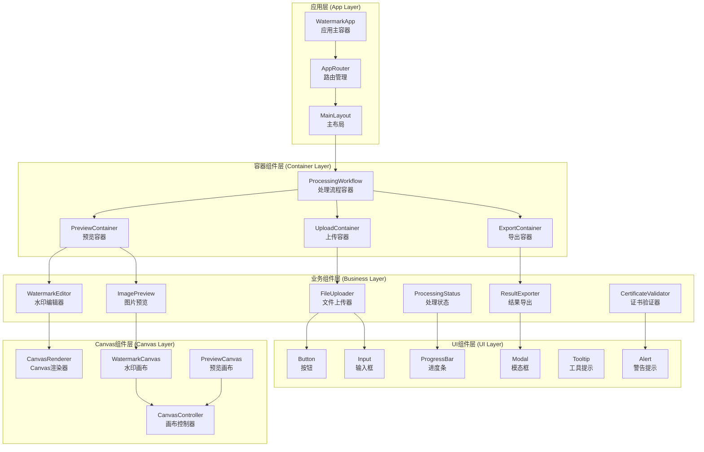
```mermaid
graph TD
    subgraph "应用层 (App Layer)"
        App[WatermarkApp<br/>应用主容器]
        Router[AppRouter<br/>路由管理]
        Layout[MainLayout<br/>主布局]
    end
    
    subgraph "容器组件层 (Container Layer)"
        Workflow[ProcessingWorkflow<br/>处理流程容器]
        Upload[UploadContainer<br/>上传容器]
        Preview[PreviewContainer<br/>预览容器]
        Export[ExportContainer<br/>导出容器]
    end
    
    subgraph "业务组件层 (Business Layer)"
        FileUploader[FileUploader<br/>文件上传器]
        WatermarkEditor[WatermarkEditor<br/>水印编辑器]
        ImagePreview[ImagePreview<br/>图片预览]
        ProcessingStatus[ProcessingStatus<br/>处理状态]
        ResultExporter[ResultExporter<br/>结果导出]
        CertificateValidator[CertificateValidator<br/>证书验证器]
    end
    
    subgraph "UI组件层 (UI Layer)"
        Button[Button<br/>按钮]
        Input[Input<br/>输入框]
        ProgressBar[ProgressBar<br/>进度条]
        Modal[Modal<br/>模态框]
        Tooltip[Tooltip<br/>工具提示]
        Alert[Alert<br/>警告提示]
    end
    
    subgraph "Canvas组件层 (Canvas Layer)"
        CanvasRenderer[CanvasRenderer<br/>Canvas渲染器]
        WatermarkCanvas[WatermarkCanvas<br/>水印画布]
        PreviewCanvas[PreviewCanvas<br/>预览画布]
        CanvasController[CanvasController<br/>画布控制器]
    end
    
    App --> Router
    Router --> Layout
    Layout --> Workflow
    
    Workflow --> Upload
    Workflow --> Preview
    Workflow --> Export
    
    Upload --> FileUploader
    Preview --> ImagePreview
    Preview --> WatermarkEditor
    Export --> ResultExporter
    
    FileUploader --> Button
    FileUploader --> Input
    WatermarkEditor --> CanvasRenderer
    ImagePreview --> WatermarkCanvas
    ProcessingStatus --> ProgressBar
    ResultExporter --> Modal
    CertificateValidator --> Alert
    
    WatermarkCanvas --> CanvasController
    PreviewCanvas --> CanvasController
```

### 2. Canvas组件详细架构

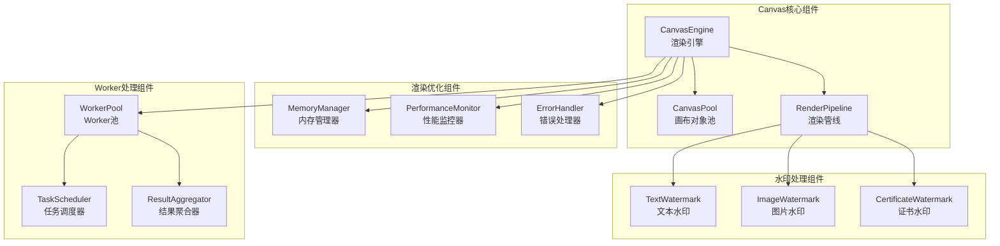
```mermaid
graph TD
    subgraph "Canvas核心组件"
        CanvasEngine[CanvasEngine<br/>渲染引擎]
        CanvasPool[CanvasPool<br/>画布对象池]
        RenderPipeline[RenderPipeline<br/>渲染管线]
    end
    
    subgraph "水印处理组件"
        TextWatermark[TextWatermark<br/>文本水印]
        ImageWatermark[ImageWatermark<br/>图片水印]
        CertificateWatermark[CertificateWatermark<br/>证书水印]
    end
    
    subgraph "渲染优化组件"
        MemoryManager[MemoryManager<br/>内存管理器]
        PerformanceMonitor[PerformanceMonitor<br/>性能监控器]
        ErrorHandler[ErrorHandler<br/>错误处理器]
    end
    
    subgraph "Worker处理组件"
        WorkerPool[WorkerPool<br/>Worker池]
        TaskScheduler[TaskScheduler<br/>任务调度器]
        ResultAggregator[ResultAggregator<br/>结果聚合器]
    end
    
    CanvasEngine --> CanvasPool
    CanvasEngine --> RenderPipeline
    
    RenderPipeline --> TextWatermark
    RenderPipeline --> ImageWatermark
    RenderPipeline --> CertificateWatermark
    
    CanvasEngine --> MemoryManager
    CanvasEngine --> PerformanceMonitor
    CanvasEngine --> ErrorHandler
    
    CanvasEngine --> WorkerPool
    WorkerPool --> TaskScheduler
    WorkerPool --> ResultAggregator
```

---

## 🔄 数据流和状态管理架构

### 1. 主要数据流架构

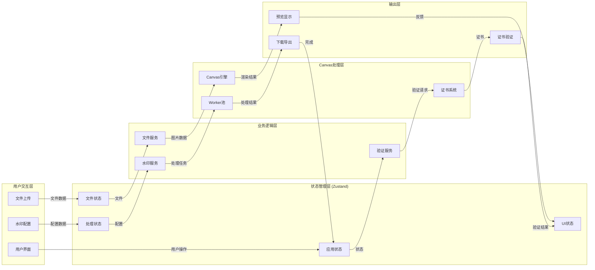
```mermaid
flowchart LR
    subgraph "用户交互层"
        UI[用户界面]
        File[文件上传]
        Config[水印配置]
    end
    
    subgraph "状态管理层 (Zustand)"
        AppState[应用状态]
        FileState[文件状态]
        ProcessState[处理状态]
        UIState[UI状态]
    end
    
    subgraph "业务逻辑层"
        FileService[文件服务]
        WatermarkService[水印服务]
        ValidationService[验证服务]
    end
    
    subgraph "Canvas处理层"
        CanvasEngine[Canvas引擎]
        WorkerPool[Worker池]
        CertificateSystem[证书系统]
    end
    
    subgraph "输出层"
        Preview[预览显示]
        Download[下载导出]
        Certificate[证书验证]
    end
    
    UI --> |用户操作| AppState
    File --> |文件数据| FileState
    Config --> |配置数据| ProcessState
    
    FileState --> |文件| FileService
    ProcessState --> |配置| WatermarkService
    AppState --> |状态| ValidationService
    
    FileService --> |图片数据| CanvasEngine
    WatermarkService --> |处理任务| WorkerPool
    ValidationService --> |验证请求| CertificateSystem
    
    CanvasEngine --> |渲染结果| Preview
    WorkerPool --> |处理结果| Download
    CertificateSystem --> |证书| Certificate
    
    Preview --> |反馈| UIState
    Download --> |完成| AppState
    Certificate --> |验证结果| UIState
```

### 2. Zustand状态管理架构

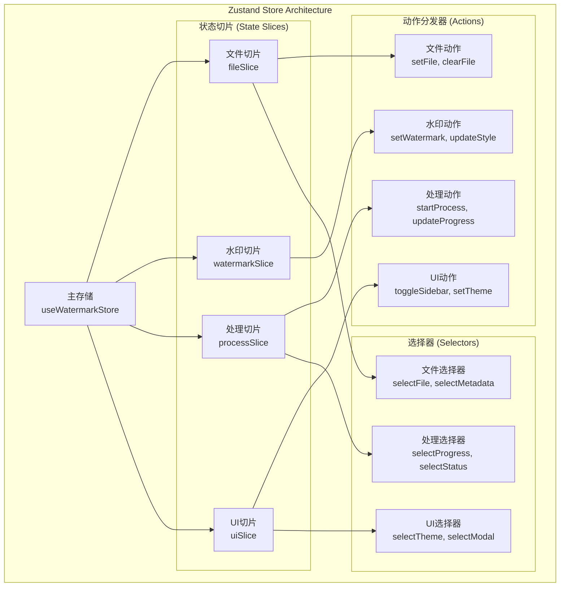
```mermaid
graph TB
    subgraph "Zustand Store Architecture"
        MainStore[主存储<br/>useWatermarkStore]
        
        subgraph "状态切片 (State Slices)"
            FileSlice[文件切片<br/>fileSlice]
            WatermarkSlice[水印切片<br/>watermarkSlice]
            ProcessSlice[处理切片<br/>processSlice]
            UISlice[UI切片<br/>uiSlice]
        end
        
        subgraph "动作分发器 (Actions)"
            FileActions[文件动作<br/>setFile, clearFile]
            WatermarkActions[水印动作<br/>setWatermark, updateStyle]
            ProcessActions[处理动作<br/>startProcess, updateProgress]
            UIActions[UI动作<br/>toggleSidebar, setTheme]
        end
        
        subgraph "选择器 (Selectors)"
            FileSelectors[文件选择器<br/>selectFile, selectMetadata]
            ProcessSelectors[处理选择器<br/>selectProgress, selectStatus]
            UISelectors[UI选择器<br/>selectTheme, selectModal]
        end
    end
    
    MainStore --> FileSlice
    MainStore --> WatermarkSlice
    MainStore --> ProcessSlice
    MainStore --> UISlice
    
    FileSlice --> FileActions
    WatermarkSlice --> WatermarkActions
    ProcessSlice --> ProcessActions
    UISlice --> UIActions
    
    FileSlice --> FileSelectors
    ProcessSlice --> ProcessSelectors
    UISlice --> UISelectors
```

---

## 🎣 Hook架构设计与依赖图

### 1. Hook依赖关系图

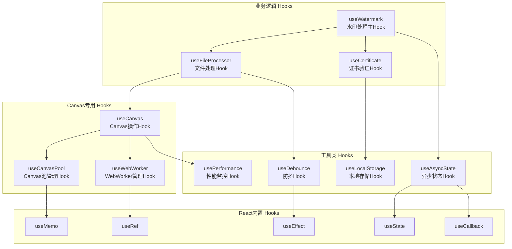
```mermaid
graph TD
    subgraph "业务逻辑 Hooks"
        useWatermark[useWatermark<br/>水印处理主Hook]
        useFileProcessor[useFileProcessor<br/>文件处理Hook]
        useCertificate[useCertificate<br/>证书验证Hook]
    end
    
    subgraph "Canvas专用 Hooks"
        useCanvas[useCanvas<br/>Canvas操作Hook]
        useCanvasPool[useCanvasPool<br/>Canvas池管理Hook]
        useWebWorker[useWebWorker<br/>WebWorker管理Hook]
    end
    
    subgraph "工具类 Hooks"
        useAsyncState[useAsyncState<br/>异步状态Hook]
        useDebounce[useDebounce<br/>防抖Hook]
        useLocalStorage[useLocalStorage<br/>本地存储Hook]
        usePerformance[usePerformance<br/>性能监控Hook]
    end
    
    subgraph "React内置 Hooks"
        useState[useState]
        useEffect[useEffect]
        useCallback[useCallback]
        useMemo[useMemo]
        useRef[useRef]
    end
    
    useWatermark --> useFileProcessor
    useWatermark --> useCertificate
    useFileProcessor --> useCanvas
    useCanvas --> useCanvasPool
    useCanvas --> useWebWorker
    
    useWatermark --> useAsyncState
    useFileProcessor --> useDebounce
    useCertificate --> useLocalStorage
    useCanvas --> usePerformance
    
    useAsyncState --> useState
    useAsyncState --> useCallback
    useDebounce --> useEffect
    useCanvasPool --> useMemo
    useWebWorker --> useRef
```

### 2. 核心Hook实现架构

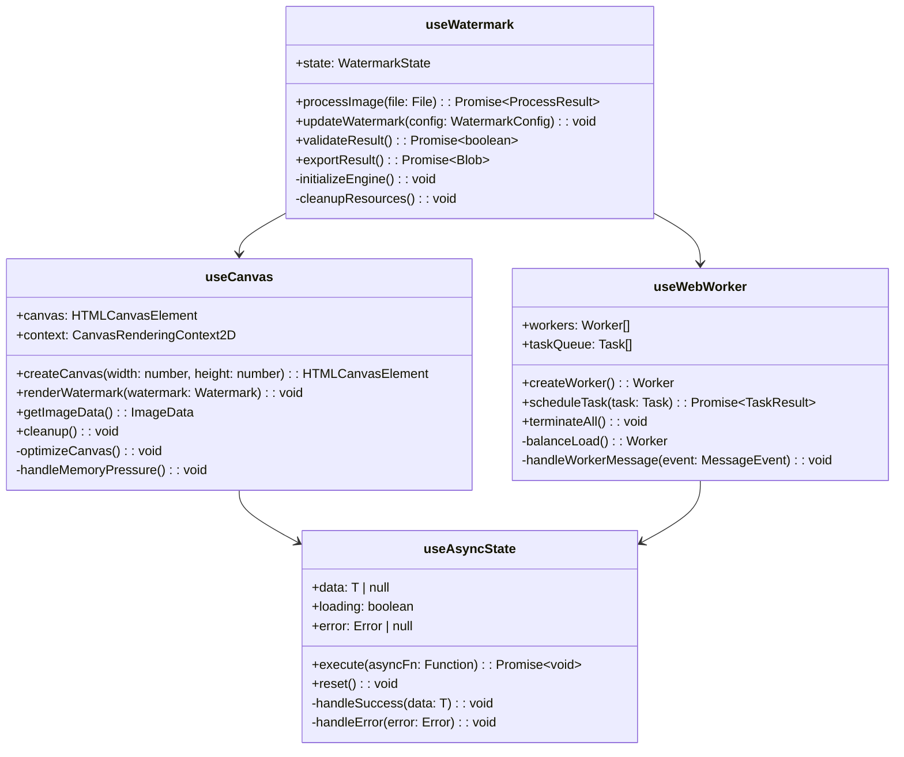
```mermaid
classDiagram
    class useWatermark {
        +state: WatermarkState
        +processImage(file: File): Promise~ProcessResult~
        +updateWatermark(config: WatermarkConfig): void
        +validateResult(): Promise~boolean~
        +exportResult(): Promise~Blob~
        -initializeEngine(): void
        -cleanupResources(): void
    }
    
    class useCanvas {
        +canvas: HTMLCanvasElement
        +context: CanvasRenderingContext2D
        +createCanvas(width: number, height: number): HTMLCanvasElement
        +renderWatermark(watermark: Watermark): void
        +getImageData(): ImageData
        +cleanup(): void
        -optimizeCanvas(): void
        -handleMemoryPressure(): void
    }
    
    class useWebWorker {
        +workers: Worker[]
        +taskQueue: Task[]
        +createWorker(): Worker
        +scheduleTask(task: Task): Promise~TaskResult~
        +terminateAll(): void
        -balanceLoad(): Worker
        -handleWorkerMessage(event: MessageEvent): void
    }
    
    class useAsyncState {
        +data: T | null
        +loading: boolean
        +error: Error | null
        +execute(asyncFn: Function): Promise~void~
        +reset(): void
        -handleSuccess(data: T): void
        -handleError(error: Error): void
    }
    
    useWatermark --> useCanvas
    useWatermark --> useWebWorker
    useCanvas --> useAsyncState
    useWebWorker --> useAsyncState
```

---

## ⚡ 性能优化组件模式

### 1. React性能优化架构

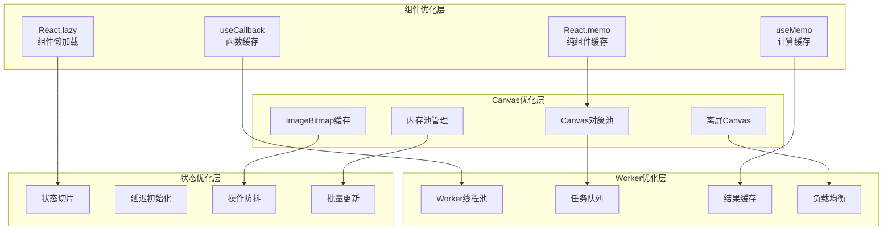
```mermaid
graph TB
    subgraph "组件优化层"
        Memo[React.memo<br/>纯组件缓存]
        Callback[useCallback<br/>函数缓存]
        MemoHook[useMemo<br/>计算缓存]
        Lazy[React.lazy<br/>组件懒加载]
    end
    
    subgraph "Canvas优化层"
        CanvasPool[Canvas对象池]
        OffscreenCanvas[离屏Canvas]
        ImageBitmap[ImageBitmap缓存]
        MemoryPool[内存池管理]
    end
    
    subgraph "Worker优化层"
        WorkerPool[Worker线程池]
        TaskQueue[任务队列]
        ResultCache[结果缓存]
        LoadBalance[负载均衡]
    end
    
    subgraph "状态优化层"
        StateSlice[状态切片]
        LazyInit[延迟初始化]
        Debounce[操作防抖]
        BatchUpdate[批量更新]
    end
    
    Memo --> CanvasPool
    Callback --> WorkerPool
    MemoHook --> ResultCache
    Lazy --> StateSlice
    
    CanvasPool --> TaskQueue
    OffscreenCanvas --> LoadBalance
    ImageBitmap --> Debounce
    MemoryPool --> BatchUpdate
```

### 2. Canvas性能优化模式

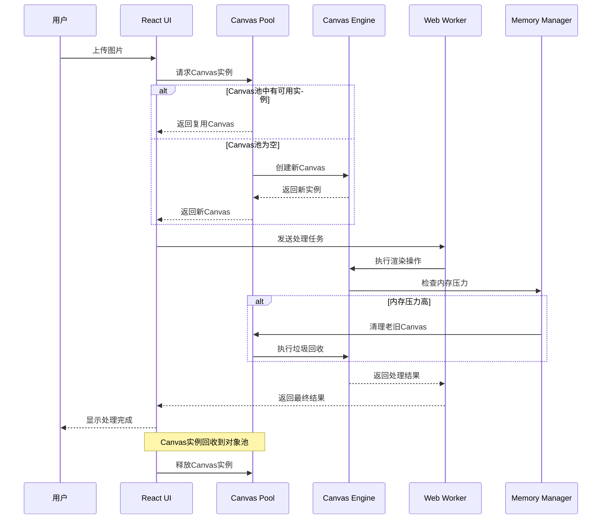
```mermaid
sequenceDiagram
    participant User as 用户
    participant UI as React UI
    participant Pool as Canvas Pool
    participant Canvas as Canvas Engine
    participant Worker as Web Worker
    participant Memory as Memory Manager
    
    User ->> UI: 上传图片
    UI ->> Pool: 请求Canvas实例
    
    alt Canvas池中有可用实例
        Pool -->> UI: 返回复用Canvas
    else Canvas池为空
        Pool ->> Canvas: 创建新Canvas
        Canvas -->> Pool: 返回新实例
        Pool -->> UI: 返回新Canvas
    end
    
    UI ->> Worker: 发送处理任务
    Worker ->> Canvas: 执行渲染操作
    
    Canvas ->> Memory: 检查内存压力
    
    alt 内存压力高
        Memory ->> Pool: 清理老旧Canvas
        Pool ->> Canvas: 执行垃圾回收
    end
    
    Canvas -->> Worker: 返回处理结果
    Worker -->> UI: 返回最终结果
    UI -->> User: 显示处理完成
    
    Note over UI, Pool: Canvas实例回收到对象池
    UI ->> Pool: 释放Canvas实例
```

---

## 🌐 浏览器兼容性架构

### 1. 兼容性检测架构

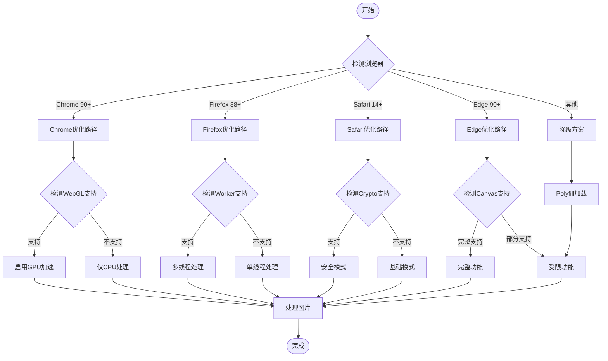
```mermaid
flowchart TD
    Start([开始]) --> CheckBrowser{检测浏览器}
    
    CheckBrowser -->|Chrome 90+| ChromeOpt[Chrome优化路径]
    CheckBrowser -->|Firefox 88+| FirefoxOpt[Firefox优化路径]
    CheckBrowser -->|Safari 14+| SafariOpt[Safari优化路径]
    CheckBrowser -->|Edge 90+| EdgeOpt[Edge优化路径]
    CheckBrowser -->|其他| Fallback[降级方案]
    
    ChromeOpt --> CheckWebGL{检测WebGL支持}
    FirefoxOpt --> CheckWorker{检测Worker支持}
    SafariOpt --> CheckCrypto{检测Crypto支持}
    EdgeOpt --> CheckCanvas{检测Canvas支持}
    
    CheckWebGL -->|支持| GPUAccel[启用GPU加速]
    CheckWebGL -->|不支持| CPUOnly[仅CPU处理]
    
    CheckWorker -->|支持| MultiThread[多线程处理]
    CheckWorker -->|不支持| SingleThread[单线程处理]
    
    CheckCrypto -->|支持| SecureMode[安全模式]
    CheckCrypto -->|不支持| BasicMode[基础模式]
    
    CheckCanvas -->|完整支持| FullFeature[完整功能]
    CheckCanvas -->|部分支持| LimitedFeature[受限功能]
    
    Fallback --> Polyfill[Polyfill加载]
    Polyfill --> LimitedFeature
    
    GPUAccel --> ProcessImage[处理图片]
    CPUOnly --> ProcessImage
    MultiThread --> ProcessImage
    SingleThread --> ProcessImage
    SecureMode --> ProcessImage
    BasicMode --> ProcessImage
    FullFeature --> ProcessImage
    LimitedFeature --> ProcessImage
    
    ProcessImage --> End([完成])
```

### 2. 渐进式增强架构

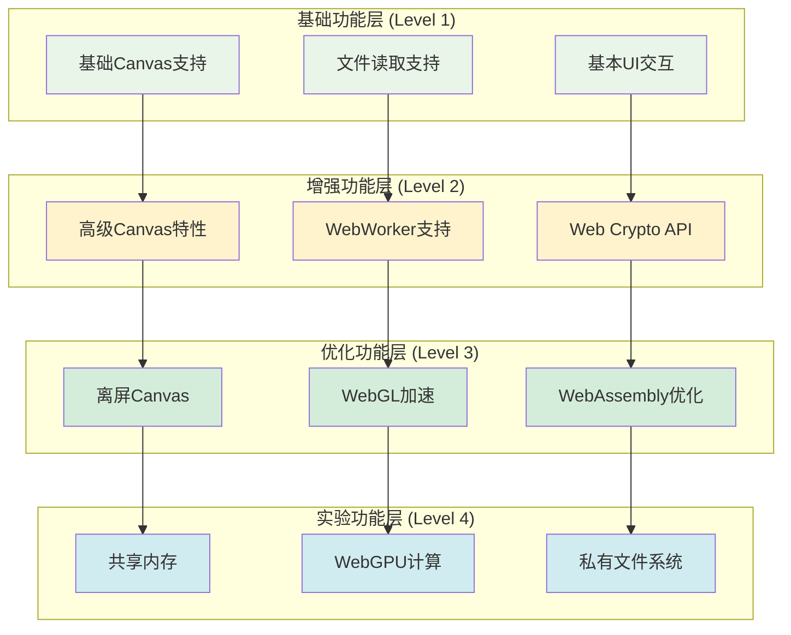
```mermaid
graph TB
    subgraph "基础功能层 (Level 1)"
        BasicCanvas[基础Canvas支持]
        BasicFile[文件读取支持]
        BasicUI[基本UI交互]
    end
    
    subgraph "增强功能层 (Level 2)"
        AdvCanvas[高级Canvas特性]
        WebWorkers[WebWorker支持]
        Crypto[Web Crypto API]
    end
    
    subgraph "优化功能层 (Level 3)"
        OffscreenCanvas[离屏Canvas]
        WebGL[WebGL加速]
        WASM[WebAssembly优化]
    end
    
    subgraph "实验功能层 (Level 4)"
        SharedArrayBuffer[共享内存]
        WebGPU[WebGPU计算]
        OriginPrivateFS[私有文件系统]
    end
    
    BasicCanvas --> AdvCanvas
    BasicFile --> WebWorkers
    BasicUI --> Crypto
    
    AdvCanvas --> OffscreenCanvas
    WebWorkers --> WebGL
    Crypto --> WASM
    
    OffscreenCanvas --> SharedArrayBuffer
    WebGL --> WebGPU
    WASM --> OriginPrivateFS
    
    classDef level1 fill:#e8f5e8
    classDef level2 fill:#fff3cd  
    classDef level3 fill:#d4edda
    classDef level4 fill:#d1ecf1
    
    class BasicCanvas,BasicFile,BasicUI level1
    class AdvCanvas,WebWorkers,Crypto level2
    class OffscreenCanvas,WebGL,WASM level3
    class SharedArrayBuffer,WebGPU,OriginPrivateFS level4
```

---

## 📱 响应式设计架构

### 1. 响应式布局组件

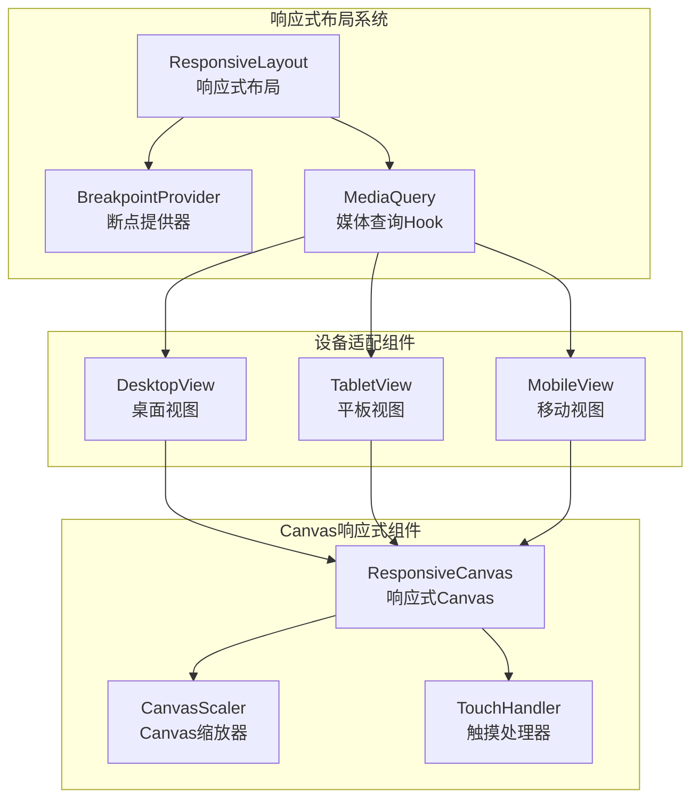
```mermaid
graph TD
    subgraph "响应式布局系统"
        ResponsiveLayout[ResponsiveLayout<br/>响应式布局]
        BreakpointProvider[BreakpointProvider<br/>断点提供器]
        MediaQuery[MediaQuery<br/>媒体查询Hook]
    end
    
    subgraph "设备适配组件"
        DesktopView[DesktopView<br/>桌面视图]
        TabletView[TabletView<br/>平板视图]  
        MobileView[MobileView<br/>移动视图]
    end
    
    subgraph "Canvas响应式组件"
        ResponsiveCanvas[ResponsiveCanvas<br/>响应式Canvas]
        CanvasScaler[CanvasScaler<br/>Canvas缩放器]
        TouchHandler[TouchHandler<br/>触摸处理器]
    end
    
    ResponsiveLayout --> BreakpointProvider
    ResponsiveLayout --> MediaQuery
    
    MediaQuery --> DesktopView
    MediaQuery --> TabletView
    MediaQuery --> MobileView
    
    ResponsiveCanvas --> CanvasScaler
    ResponsiveCanvas --> TouchHandler
    
    DesktopView --> ResponsiveCanvas
    TabletView --> ResponsiveCanvas
    MobileView --> ResponsiveCanvas
```

### 2. Tailwind CSS响应式系统

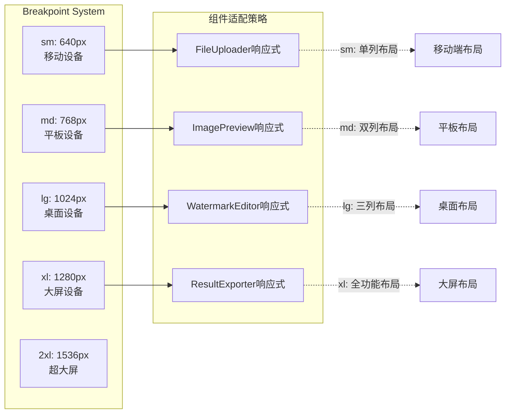
```mermaid
graph LR
    subgraph "Breakpoint System"
        SM[sm: 640px<br/>移动设备]
        MD[md: 768px<br/>平板设备]
        LG[lg: 1024px<br/>桌面设备]
        XL[xl: 1280px<br/>大屏设备]
        XXL[2xl: 1536px<br/>超大屏]
    end
    
    subgraph "组件适配策略"
        FileUploader_R[FileUploader响应式]
        ImagePreview_R[ImagePreview响应式]
        WatermarkEditor_R[WatermarkEditor响应式]
        ResultExporter_R[ResultExporter响应式]
    end
    
    SM --> FileUploader_R
    MD --> ImagePreview_R
    LG --> WatermarkEditor_R
    XL --> ResultExporter_R
    
    FileUploader_R -.->|sm: 单列布局| Mobile_Layout[移动端布局]
    ImagePreview_R -.->|md: 双列布局| Tablet_Layout[平板布局]
    WatermarkEditor_R -.->|lg: 三列布局| Desktop_Layout[桌面布局]
    ResultExporter_R -.->|xl: 全功能布局| Large_Layout[大屏布局]
```

---

## 🧪 组件测试架构

### 1. 测试组件层次

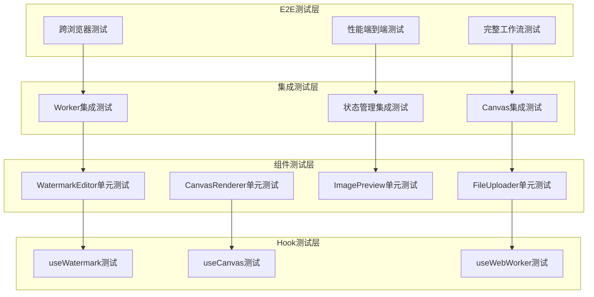
```mermaid
graph TB
    subgraph "E2E测试层"
        E2E_Workflow[完整工作流测试]
        E2E_CrossBrowser[跨浏览器测试]
        E2E_Performance[性能端到端测试]
    end
    
    subgraph "集成测试层"
        Integration_Canvas[Canvas集成测试]
        Integration_Worker[Worker集成测试]
        Integration_State[状态管理集成测试]
    end
    
    subgraph "组件测试层"
        Unit_FileUploader[FileUploader单元测试]
        Unit_WatermarkEditor[WatermarkEditor单元测试]
        Unit_ImagePreview[ImagePreview单元测试]
        Unit_CanvasRenderer[CanvasRenderer单元测试]
    end
    
    subgraph "Hook测试层"
        Hook_useWatermark[useWatermark测试]
        Hook_useCanvas[useCanvas测试]
        Hook_useWebWorker[useWebWorker测试]
    end
    
    E2E_Workflow --> Integration_Canvas
    E2E_CrossBrowser --> Integration_Worker
    E2E_Performance --> Integration_State
    
    Integration_Canvas --> Unit_FileUploader
    Integration_Worker --> Unit_WatermarkEditor
    Integration_State --> Unit_ImagePreview
    
    Unit_CanvasRenderer --> Hook_useCanvas
    Unit_WatermarkEditor --> Hook_useWatermark
    Unit_FileUploader --> Hook_useWebWorker
```

### 2. Canvas测试专用架构

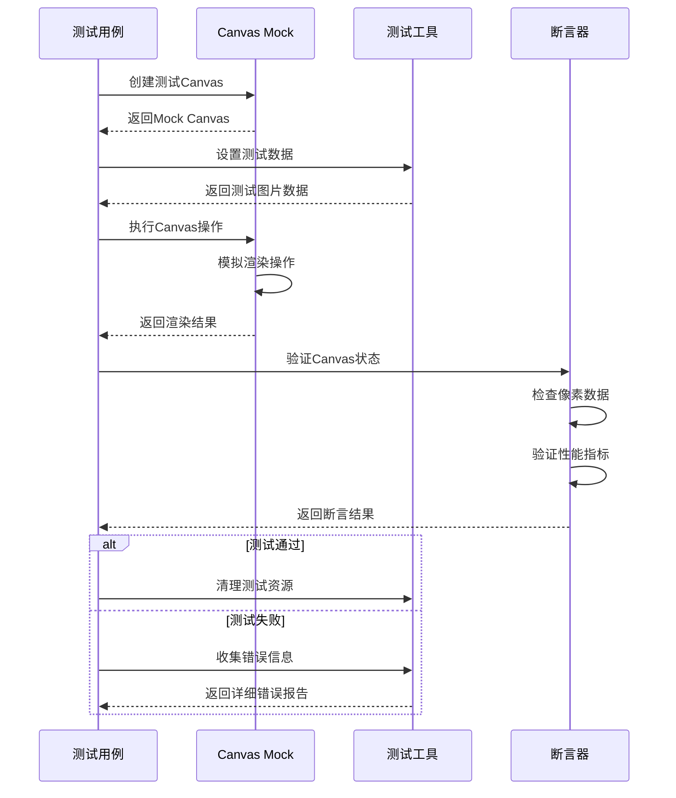
```mermaid
sequenceDiagram
    participant Test as 测试用例
    participant Mock as Canvas Mock
    participant Utils as 测试工具
    participant Assert as 断言器
    
    Test ->> Mock: 创建测试Canvas
    Mock -->> Test: 返回Mock Canvas
    
    Test ->> Utils: 设置测试数据
    Utils -->> Test: 返回测试图片数据
    
    Test ->> Mock: 执行Canvas操作
    Mock ->> Mock: 模拟渲染操作
    Mock -->> Test: 返回渲染结果
    
    Test ->> Assert: 验证Canvas状态
    Assert ->> Assert: 检查像素数据
    Assert ->> Assert: 验证性能指标
    Assert -->> Test: 返回断言结果
    
    alt 测试通过
        Test ->> Utils: 清理测试资源
    else 测试失败
        Test ->> Utils: 收集错误信息
        Utils -->> Test: 返回详细错误报告
    end
```

---

## 📊 组件性能监控架构

### 1. 性能监控组件

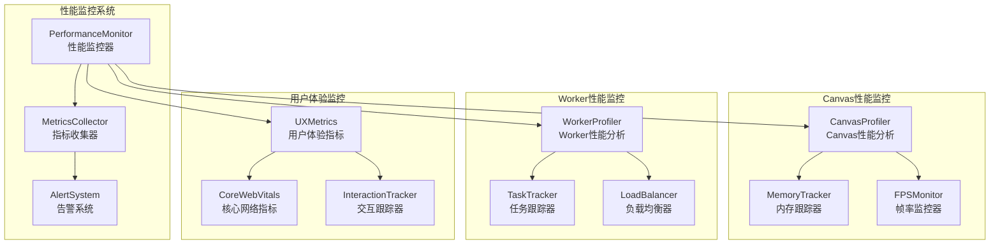
```mermaid
graph TD
    subgraph "性能监控系统"
        PerfMonitor[PerformanceMonitor<br/>性能监控器]
        MetricsCollector[MetricsCollector<br/>指标收集器]
        AlertSystem[AlertSystem<br/>告警系统]
    end
    
    subgraph "Canvas性能监控"
        CanvasProfiler[CanvasProfiler<br/>Canvas性能分析]
        MemoryTracker[MemoryTracker<br/>内存跟踪器]
        FPSMonitor[FPSMonitor<br/>帧率监控器]
    end
    
    subgraph "Worker性能监控"  
        WorkerProfiler[WorkerProfiler<br/>Worker性能分析]
        TaskTracker[TaskTracker<br/>任务跟踪器]
        LoadBalancer[LoadBalancer<br/>负载均衡器]
    end
    
    subgraph "用户体验监控"
        UXMetrics[UXMetrics<br/>用户体验指标]
        CoreWebVitals[CoreWebVitals<br/>核心网络指标]
        InteractionTracker[InteractionTracker<br/>交互跟踪器]
    end
    
    PerfMonitor --> MetricsCollector
    MetricsCollector --> AlertSystem
    
    PerfMonitor --> CanvasProfiler
    PerfMonitor --> WorkerProfiler
    PerfMonitor --> UXMetrics
    
    CanvasProfiler --> MemoryTracker
    CanvasProfiler --> FPSMonitor
    
    WorkerProfiler --> TaskTracker
    WorkerProfiler --> LoadBalancer
    
    UXMetrics --> CoreWebVitals
    UXMetrics --> InteractionTracker
```

### 2. 实时性能Dashboard

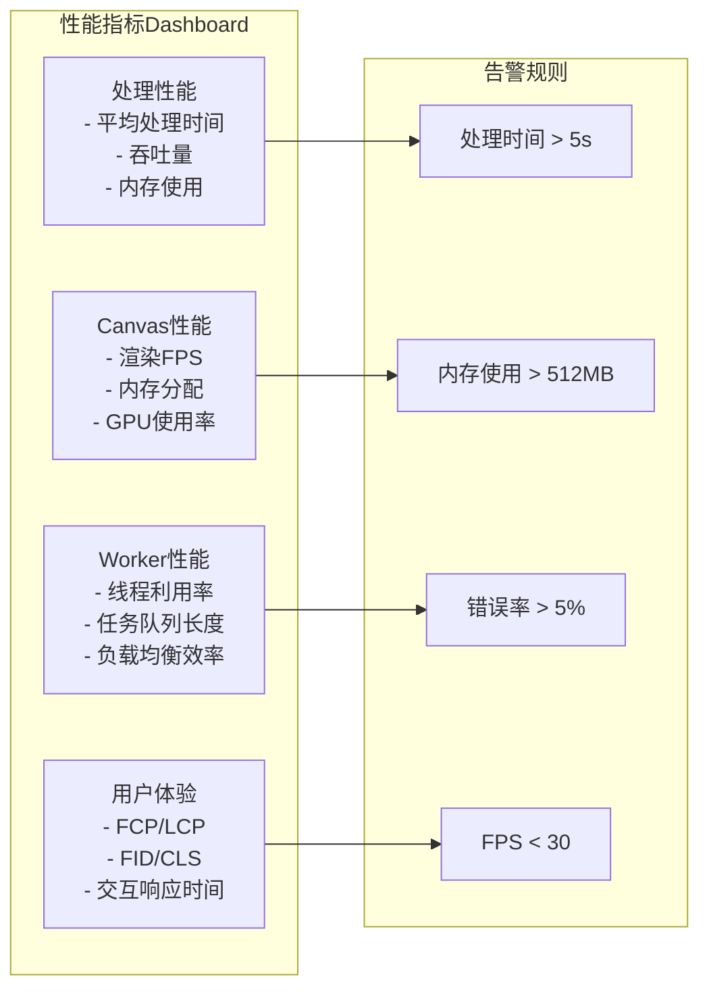
```mermaid
graph LR
    subgraph "性能指标Dashboard"
        Processing[处理性能<br/>- 平均处理时间<br/>- 吞吐量<br/>- 内存使用]
        
        Canvas[Canvas性能<br/>- 渲染FPS<br/>- 内存分配<br/>- GPU使用率]
        
        Worker[Worker性能<br/>- 线程利用率<br/>- 任务队列长度<br/>- 负载均衡效率]
        
        UX[用户体验<br/>- FCP/LCP<br/>- FID/CLS<br/>- 交互响应时间]
    end
    
    subgraph "告警规则"
        ProcessingAlert[处理时间 > 5s]
        MemoryAlert[内存使用 > 512MB]
        ErrorAlert[错误率 > 5%]
        PerformanceAlert[FPS < 30]
    end
    
    Processing --> ProcessingAlert
    Canvas --> MemoryAlert
    Worker --> ErrorAlert
    UX --> PerformanceAlert
```

---

## 🔄 组件生命周期管理

### 1. 组件挂载与卸载流程

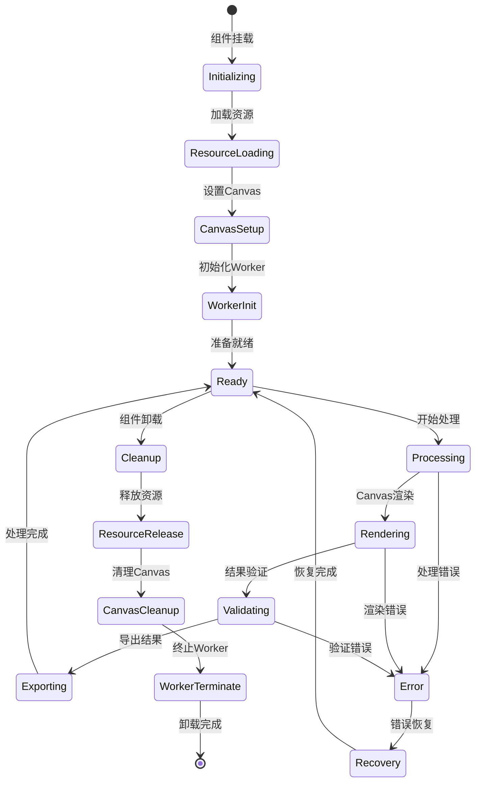
```mermaid
stateDiagram-v2
    [*] --> Initializing: 组件挂载
    
    Initializing --> ResourceLoading: 加载资源
    ResourceLoading --> CanvasSetup: 设置Canvas
    CanvasSetup --> WorkerInit: 初始化Worker
    WorkerInit --> Ready: 准备就绪
    
    Ready --> Processing: 开始处理
    Processing --> Rendering: Canvas渲染
    Rendering --> Validating: 结果验证
    Validating --> Exporting: 导出结果
    
    Exporting --> Ready: 处理完成
    Ready --> Cleanup: 组件卸载
    
    Cleanup --> ResourceRelease: 释放资源
    ResourceRelease --> CanvasCleanup: 清理Canvas
    CanvasCleanup --> WorkerTerminate: 终止Worker
    WorkerTerminate --> [*]: 卸载完成
    
    Processing --> Error: 处理错误
    Rendering --> Error: 渲染错误
    Validating --> Error: 验证错误
    Error --> Recovery: 错误恢复
    Recovery --> Ready: 恢复完成
```

### 2. 资源管理生命周期

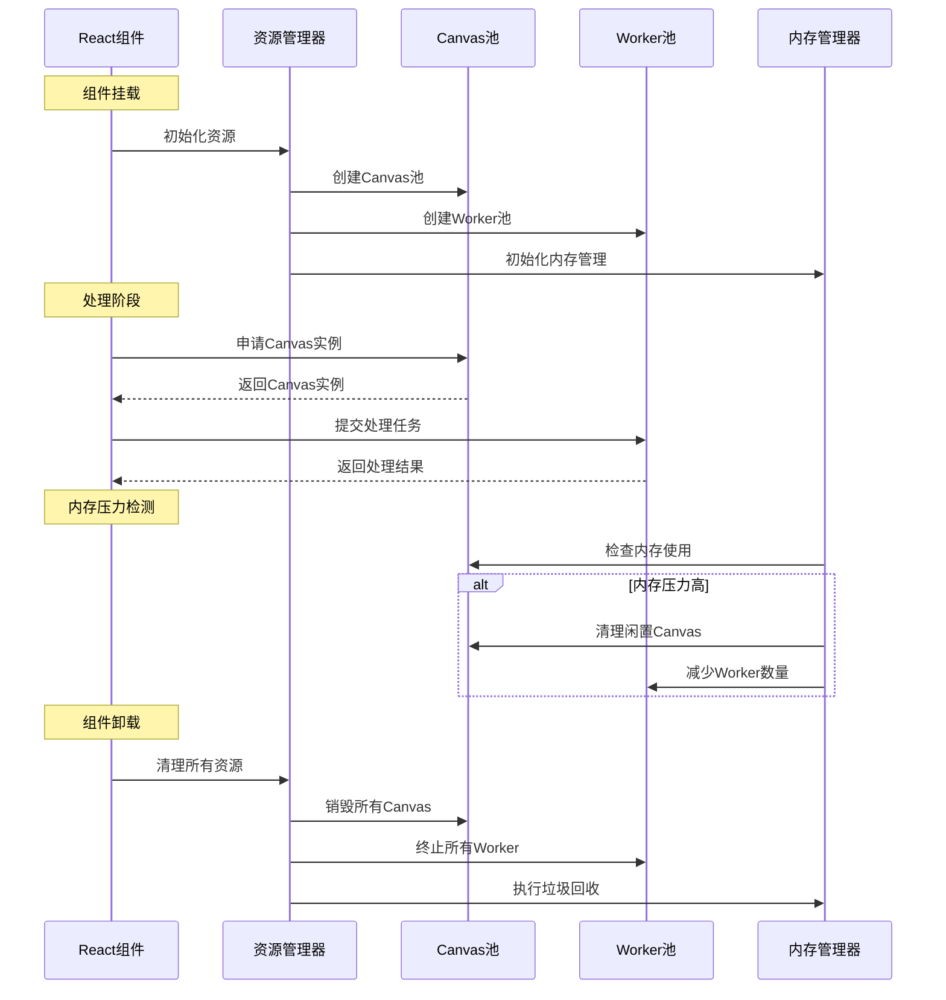
```mermaid
sequenceDiagram
    participant Component as React组件
    participant ResourceManager as 资源管理器
    participant CanvasPool as Canvas池
    participant WorkerPool as Worker池
    participant MemoryManager as 内存管理器
    
    Note over Component: 组件挂载
    Component ->> ResourceManager: 初始化资源
    ResourceManager ->> CanvasPool: 创建Canvas池
    ResourceManager ->> WorkerPool: 创建Worker池
    ResourceManager ->> MemoryManager: 初始化内存管理
    
    Note over Component: 处理阶段
    Component ->> CanvasPool: 申请Canvas实例
    CanvasPool -->> Component: 返回Canvas实例
    
    Component ->> WorkerPool: 提交处理任务
    WorkerPool -->> Component: 返回处理结果
    
    Note over Component: 内存压力检测
    MemoryManager ->> CanvasPool: 检查内存使用
    alt 内存压力高
        MemoryManager ->> CanvasPool: 清理闲置Canvas
        MemoryManager ->> WorkerPool: 减少Worker数量
    end
    
    Note over Component: 组件卸载
    Component ->> ResourceManager: 清理所有资源
    ResourceManager ->> CanvasPool: 销毁所有Canvas
    ResourceManager ->> WorkerPool: 终止所有Worker
    ResourceManager ->> MemoryManager: 执行垃圾回收
```

---

## 📋 组件最佳实践指南

### 1. Canvas组件开发最佳实践

```typescript
// ✅ 正确的Canvas组件实现模式
const WatermarkCanvas: React.FC<WatermarkCanvasProps> = React.memo(({
  imageData,
  watermarkConfig,
  onRenderComplete
}) => {
  // 1. 使用Ref管理Canvas实例
  const canvasRef = useRef<HTMLCanvasElement>(null);
  
  // 2. 使用自定义Hook管理Canvas逻辑
  const { 
    renderWatermark, 
    cleanup, 
    isRendering 
  } = useCanvas({
    canvas: canvasRef.current,
    onComplete: onRenderComplete
  });
  
  // 3. 性能优化：使用useMemo缓存复杂计算
  const processedConfig = useMemo(() => {
    return optimizeWatermarkConfig(watermarkConfig);
  }, [watermarkConfig]);
  
  // 4. 副作用管理：确保资源清理
  useEffect(() => {
    if (imageData && processedConfig) {
      renderWatermark(imageData, processedConfig);
    }
    
    return () => {
      cleanup(); // 清理Canvas资源
    };
  }, [imageData, processedConfig, renderWatermark, cleanup]);
  
  return (
    <canvas 
      ref={canvasRef}
      className="watermark-canvas"
      style={{ 
        maxWidth: '100%',
        height: 'auto',
        imageRendering: 'pixelated' // Canvas优化
      }}
    />
  );
});

// 设置显示名称用于调试
WatermarkCanvas.displayName = 'WatermarkCanvas';
```

### 2. Hook组合模式最佳实践

```typescript
// ✅ 正确的Hook组合模式
const useWatermarkProcessor = (config: WatermarkConfig) => {
  // 1. 基础状态管理
  const [state, setState] = useAsyncState<ProcessingResult>();
  
  // 2. Canvas资源管理
  const { canvas, context, cleanup: cleanupCanvas } = useCanvas();
  
  // 3. WebWorker管理  
  const { processInWorker, cleanup: cleanupWorker } = useWebWorker();
  
  // 4. 性能监控
  const { startTiming, endTiming } = usePerformanceMonitor();
  
  // 5. 主处理函数
  const processImage = useCallback(async (file: File) => {
    startTiming('watermark-processing');
    
    try {
      setState({ loading: true, error: null });
      
      // Canvas预处理
      const imageData = await loadImageToCanvas(file, canvas);
      
      // Worker并行处理
      const result = await processInWorker({
        imageData,
        watermarkConfig: config,
        canvas: context
      });
      
      setState({ data: result, loading: false });
      
    } catch (error) {
      setState({ error: error as Error, loading: false });
    } finally {
      endTiming('watermark-processing');
    }
  }, [canvas, context, config, processInWorker, setState, startTiming, endTiming]);
  
  // 6. 清理函数
  useEffect(() => {
    return () => {
      cleanupCanvas();
      cleanupWorker();
    };
  }, [cleanupCanvas, cleanupWorker]);
  
  return {
    ...state,
    processImage,
    canvas
  };
};
```

---

**文档版本**: v1.0.0  
**最后更新**: 2025-08-30  
**维护团队**: 水印增强产品前端架构团队  
**可视化工具**: Mermaid v10.0+

*本组件架构图表文档通过丰富的可视化图表，全面展示了水印增强产品的组件设计模式、数据流架构和性能优化策略，重点突出了Canvas渲染组件和WebWorker处理组件的协作关系。*