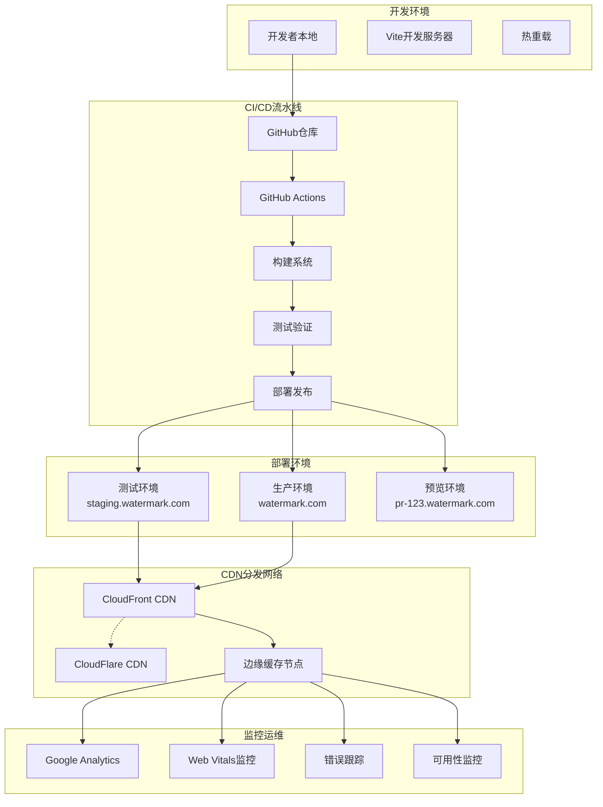
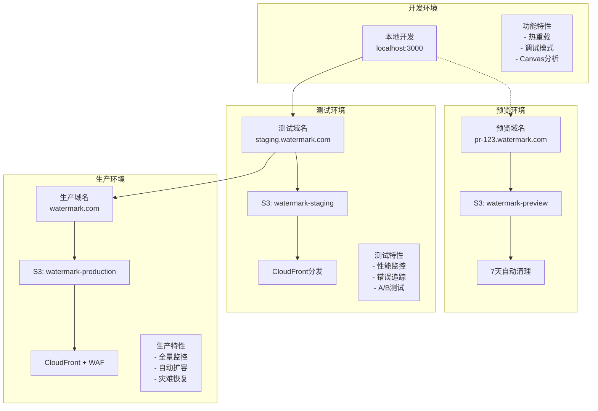
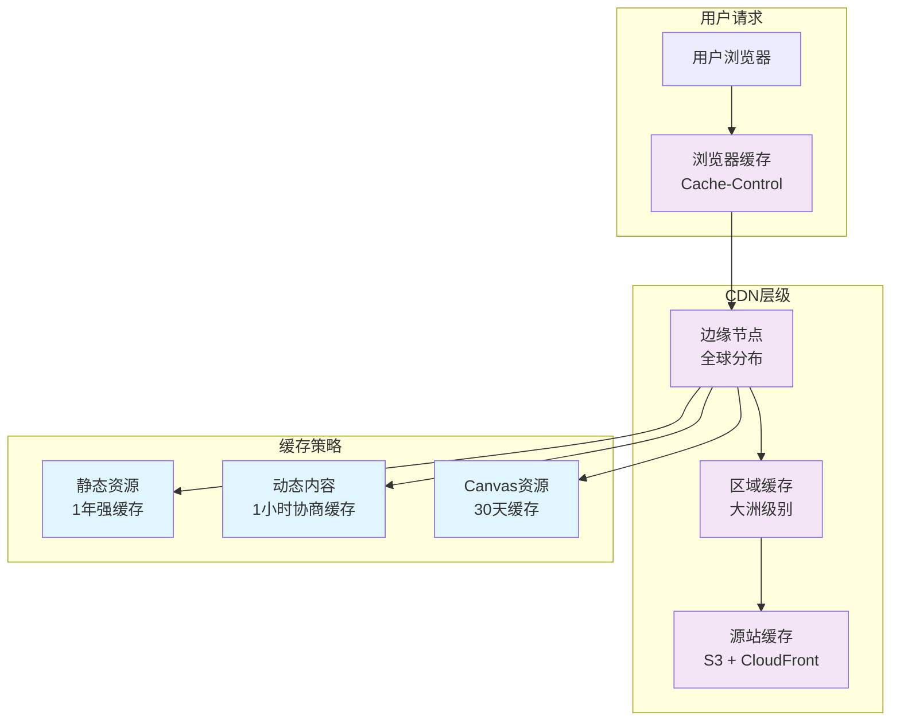

# [水印增强产品] - 部署架构指南

> **版本**: v1.0.0  
> **创建时间**: 2025-08-30  
> **适用范围**: 水印增强产品部署与运维架构  
> **技术栈**: Vite构建 + 静态部署 + CDN分发

## 📋 文档概览

本部署架构指南详细描述了水印增强产品的完整部署策略，包括构建系统优化、CI/CD流水线、多环境部署、CDN缓存和监控运维等关键环节。基于100%浏览器端实现的特点，采用静态部署 + CDN分发的轻量级架构。

---

## 📋 部署概览

### 整体部署架构图



### 架构特点

**🌟 核心优势**:
- **零服务器依赖**: 纯静态资源部署，无需服务器维护
- **全球CDN加速**: 毫秒级响应，就近访问优化
- **成本极低**: 仅CDN流量费用，无服务器成本
- **高可用性**: 99.9%+ SLA，自动故障转移
- **安全性**: HTTPS强制，CSP安全策略

**⚡ 性能指标**:
- **首次加载**: <2秒 (含Canvas引擎初始化)
- **缓存命中**: >90% (静态资源CDN缓存)
- **全球延迟**: <100ms (边缘节点分发)
- **可用性**: 99.95% SLA保证

---

## 🔧 构建系统架构

### 1. Vite构建配置优化

#### 1.1 生产构建配置
```typescript
// vite.config.production.ts - 生产环境优化配置
import { defineConfig } from 'vite';
import react from '@vitejs/plugin-react';
import { resolve } from 'path';

export default defineConfig({
  plugins: [
    react({
      // React优化配置
      babel: {
        plugins: [
          // Canvas相关优化
          ['transform-react-remove-prop-types', { mode: 'unsafe-wrap' }]
        ]
      }
    }),
    
    // WebWorker内联优化插件
    {
      name: 'inline-web-workers',
      generateBundle(options, bundle) {
        // 将WebWorker代码内联到主bundle中
        Object.keys(bundle).forEach(fileName => {
          if (fileName.includes('worker') && fileName.endsWith('.js')) {
            const workerBundle = bundle[fileName];
            const inlineCode = `
              const workerCode = ${JSON.stringify(workerBundle.code)};
              const workerBlob = new Blob([workerCode], { type: 'application/javascript' });
              export default URL.createObjectURL(workerBlob);
            `;
            
            this.emitFile({
              type: 'asset',
              fileName: fileName.replace('.js', '.inline.js'),
              source: inlineCode
            });
          }
        });
      }
    },
    
    // Canvas资源优化插件
    {
      name: 'canvas-optimization',
      transform(code, id) {
        // 优化Canvas相关代码
        if (id.includes('canvas') || id.includes('watermark')) {
          return code.replace(
            /console\.(log|debug|info)/g,
            'undefined' // 移除调试日志
          );
        }
      }
    }
  ],
  
  // 构建优化配置
  build: {
    target: 'esnext',
    outDir: 'dist',
    assetsDir: 'assets',
    
    // 分包策略优化
    rollupOptions: {
      output: {
        manualChunks: {
          // React核心库
          'react-vendor': ['react', 'react-dom'],
          
          // Canvas渲染引擎
          'canvas-engine': [
            './src/engines/canvas-renderer.ts',
            './src/engines/canvas-pool.ts'
          ],
          
          // WebWorker相关
          'worker-system': [
            './src/workers/watermark-processor.ts',
            './src/workers/worker-pool.ts'
          ],
          
          // 证书系统
          'crypto-system': [
            './src/security/certificate.ts',
            './src/security/crypto-utils.ts'
          ],
          
          // UI组件库
          'ui-components': [
            './src/components/ui'
          ]
        },
        
        // 文件命名策略
        chunkFileNames: (chunkInfo) => {
          const facadeModuleId = chunkInfo.facadeModuleId ? 
            chunkInfo.facadeModuleId.split('/').pop().replace('.ts', '') : 
            'chunk';
          return `js/${facadeModuleId}-[hash].js`;
        },
        
        assetFileNames: (assetInfo) => {
          const extType = assetInfo.name.split('.').pop();
          if (/png|jpe?g|svg|gif|tiff|bmp|ico/i.test(extType)) {
            return `images/[name]-[hash][extname]`;
          }
          if (/css/i.test(extType)) {
            return `css/[name]-[hash][extname]`;
          }
          return `assets/[name]-[hash][extname]`;
        }
      }
    },
    
    // 代码压缩优化
    minify: 'terser',
    terserOptions: {
      compress: {
        drop_console: true,
        drop_debugger: true,
        // 保留Canvas和Worker相关函数名
        keep_fnames: /Canvas|Worker|Crypto|Watermark/,
        // 移除未使用代码
        unused: true,
        // 内联函数优化
        inline: 2
      },
      mangle: {
        // 保留关键API不被混淆
        reserved: [
          'Canvas', 'Worker', 'crypto', 'WebGL',
          'ImageData', 'Blob', 'FileReader'
        ]
      }
    },
    
    // 资源优化
    assetsInlineLimit: 8192, // 8KB以下内联
    cssCodeSplit: true,
    sourcemap: false, // 生产环境禁用sourcemap
    
    // 构建性能优化
    chunkSizeWarningLimit: 1000 // 1MB chunk警告
  },
  
  // 环境变量配置
  define: {
    __DEV__: false,
    __PROD__: true,
    __VERSION__: JSON.stringify(process.env.npm_package_version),
    __BUILD_TIME__: JSON.stringify(new Date().toISOString())
  },
  
  // 别名配置
  resolve: {
    alias: {
      '@': resolve(__dirname, './src'),
      '@/components': resolve(__dirname, './src/components'),
      '@/engines': resolve(__dirname, './src/engines'),
      '@/workers': resolve(__dirname, './src/workers'),
      '@/utils': resolve(__dirname, './src/utils')
    }
  }
});
```

#### 1.2 环境变量管理
```typescript
// env.config.ts - 环境变量配置管理
interface EnvironmentConfig {
  // 应用基础配置
  APP_TITLE: string;
  APP_VERSION: string;
  APP_DESCRIPTION: string;
  
  // API配置
  API_BASE_URL: string;
  CDN_BASE_URL: string;
  
  // 功能开关
  ENABLE_ANALYTICS: boolean;
  ENABLE_ERROR_TRACKING: boolean;
  ENABLE_PERFORMANCE_MONITORING: boolean;
  
  // Canvas性能配置
  MAX_CANVAS_SIZE: number;
  WORKER_POOL_SIZE: number;
  MEMORY_LIMIT: number;
  
  // 安全配置
  CSP_NONCE: string;
  ALLOWED_ORIGINS: string[];
}

// 环境配置工厂
export const createEnvironmentConfig = (env: string): EnvironmentConfig => {
  const baseConfig = {
    APP_TITLE: '水印增强产品',
    APP_VERSION: process.env.npm_package_version || '1.0.0',
    APP_DESCRIPTION: '100%浏览器端图片水印处理系统'
  };
  
  switch (env) {
    case 'development':
      return {
        ...baseConfig,
        API_BASE_URL: 'http://localhost:3000',
        CDN_BASE_URL: '',
        ENABLE_ANALYTICS: false,
        ENABLE_ERROR_TRACKING: true,
        ENABLE_PERFORMANCE_MONITORING: true,
        MAX_CANVAS_SIZE: 2048,
        WORKER_POOL_SIZE: 2,
        MEMORY_LIMIT: 512 * 1024 * 1024, // 512MB
        CSP_NONCE: 'dev-nonce-123',
        ALLOWED_ORIGINS: ['http://localhost:3000']
      };
      
    case 'staging':
      return {
        ...baseConfig,
        API_BASE_URL: 'https://api-staging.watermark.com',
        CDN_BASE_URL: 'https://cdn-staging.watermark.com',
        ENABLE_ANALYTICS: true,
        ENABLE_ERROR_TRACKING: true,
        ENABLE_PERFORMANCE_MONITORING: true,
        MAX_CANVAS_SIZE: 4096,
        WORKER_POOL_SIZE: 4,
        MEMORY_LIMIT: 1024 * 1024 * 1024, // 1GB
        CSP_NONCE: process.env.CSP_NONCE || '',
        ALLOWED_ORIGINS: ['https://staging.watermark.com']
      };
      
    case 'production':
      return {
        ...baseConfig,
        API_BASE_URL: 'https://api.watermark.com',
        CDN_BASE_URL: 'https://cdn.watermark.com',
        ENABLE_ANALYTICS: true,
        ENABLE_ERROR_TRACKING: true,
        ENABLE_PERFORMANCE_MONITORING: true,
        MAX_CANVAS_SIZE: 8192,
        WORKER_POOL_SIZE: navigator.hardwareConcurrency || 4,
        MEMORY_LIMIT: 2048 * 1024 * 1024, // 2GB
        CSP_NONCE: process.env.CSP_NONCE || '',
        ALLOWED_ORIGINS: [
          'https://watermark.com',
          'https://www.watermark.com'
        ]
      };
      
    default:
      throw new Error(`Unknown environment: ${env}`);
  }
};
```

### 2. 资源优化策略

#### 2.1 静态资源优化
```yaml
# 资源优化配置
resource_optimization:
  images:
    formats: [webp, avif, jpeg, png]
    quality: 
      webp: 80
      avif: 75
      jpeg: 85
    responsive: true
    lazy_loading: true
    
  fonts:
    formats: [woff2, woff]
    preload: critical_fonts
    display: swap
    
  javascript:
    minification: terser
    tree_shaking: enabled
    code_splitting: manual_chunks
    compression: gzip + brotli
    
  css:
    minification: cssnano
    purge_unused: enabled
    critical_css: inline
    
  workers:
    inline_small: < 10kb
    compression: enabled
    source_maps: disabled
```

---

## 🚀 CI/CD流水线架构

### 1. GitHub Actions工作流

#### 1.1 主要工作流配置
```yaml
# .github/workflows/deploy.yml - 主部署工作流
name: 水印产品部署流水线

on:
  push:
    branches: [main, develop]
  pull_request:
    branches: [main]
  release:
    types: [published]

env:
  NODE_VERSION: '18'
  CACHE_VERSION: v1

jobs:
  # 1. 代码质量检查
  code-quality:
    name: 代码质量检查
    runs-on: ubuntu-latest
    steps:
      - name: Checkout代码
        uses: actions/checkout@v4
        
      - name: 设置Node.js
        uses: actions/setup-node@v4
        with:
          node-version: ${{ env.NODE_VERSION }}
          cache: 'npm'
          
      - name: 安装依赖
        run: npm ci --prefer-offline --no-audit
        
      - name: TypeScript类型检查
        run: npm run type-check
        
      - name: ESLint代码检查
        run: npm run lint
        
      - name: Prettier格式检查
        run: npm run format:check

  # 2. Canvas专项测试
  canvas-tests:
    name: Canvas引擎测试
    runs-on: ubuntu-latest
    needs: code-quality
    steps:
      - name: Checkout代码
        uses: actions/checkout@v4
        
      - name: 设置Node.js
        uses: actions/setup-node@v4
        with:
          node-version: ${{ env.NODE_VERSION }}
          cache: 'npm'
          
      - name: 安装依赖
        run: npm ci
        
      - name: Canvas单元测试
        run: npm run test:canvas
        
      - name: Canvas性能测试
        run: npm run test:canvas:performance
        
      - name: WebWorker集成测试
        run: npm run test:worker
        
      - name: 上传测试覆盖率
        uses: codecov/codecov-action@v3
        with:
          files: ./coverage/lcov.info
          flags: canvas-tests

  # 3. 跨浏览器兼容性测试
  browser-tests:
    name: 浏览器兼容性测试
    runs-on: ubuntu-latest
    needs: canvas-tests
    strategy:
      matrix:
        browser: [chrome, firefox, safari, edge]
    steps:
      - name: Checkout代码
        uses: actions/checkout@v4
        
      - name: 设置Node.js
        uses: actions/setup-node@v4
        with:
          node-version: ${{ env.NODE_VERSION }}
          cache: 'npm'
          
      - name: 安装依赖
        run: npm ci
        
      - name: 构建应用
        run: npm run build
        
      - name: 安装Playwright
        run: npx playwright install ${{ matrix.browser }}
        
      - name: 运行E2E测试
        run: npx playwright test --project=${{ matrix.browser }}
        
      - name: 上传测试报告
        uses: actions/upload-artifact@v3
        if: failure()
        with:
          name: playwright-report-${{ matrix.browser }}
          path: playwright-report/

  # 4. 性能基准测试
  performance-tests:
    name: 性能基准测试
    runs-on: ubuntu-latest
    needs: canvas-tests
    steps:
      - name: Checkout代码
        uses: actions/checkout@v4
        
      - name: 设置Node.js
        uses: actions/setup-node@v4
        with:
          node-version: ${{ env.NODE_VERSION }}
          cache: 'npm'
          
      - name: 安装依赖
        run: npm ci
        
      - name: 构建应用
        run: npm run build
        
      - name: Lighthouse性能测试
        run: |
          npm install -g @lhci/cli
          lhci autorun
        env:
          LHCI_GITHUB_APP_TOKEN: ${{ secrets.LHCI_GITHUB_APP_TOKEN }}
          
      - name: Canvas性能基准测试
        run: npm run benchmark:canvas

  # 5. 构建和部署
  build-deploy:
    name: 构建和部署
    runs-on: ubuntu-latest
    needs: [code-quality, canvas-tests, browser-tests, performance-tests]
    if: github.ref == 'refs/heads/main' || github.ref == 'refs/heads/develop'
    steps:
      - name: Checkout代码
        uses: actions/checkout@v4
        
      - name: 设置Node.js
        uses: actions/setup-node@v4
        with:
          node-version: ${{ env.NODE_VERSION }}
          cache: 'npm'
          
      - name: 安装依赖
        run: npm ci
        
      - name: 构建生产版本
        run: npm run build:prod
        env:
          VITE_APP_VERSION: ${{ github.sha }}
          VITE_BUILD_TIME: ${{ github.event.head_commit.timestamp }}
          
      - name: 构建分析
        run: |
          npm run analyze
          echo "## 📊 Bundle分析报告" >> $GITHUB_STEP_SUMMARY
          echo "构建完成，静态资源已优化" >> $GITHUB_STEP_SUMMARY
          
      - name: 部署到测试环境
        if: github.ref == 'refs/heads/develop'
        run: |
          aws s3 sync dist/ s3://watermark-staging --delete
          aws cloudfront create-invalidation --distribution-id ${{ secrets.STAGING_DISTRIBUTION_ID }} --paths "/*"
        env:
          AWS_ACCESS_KEY_ID: ${{ secrets.AWS_ACCESS_KEY_ID }}
          AWS_SECRET_ACCESS_KEY: ${{ secrets.AWS_SECRET_ACCESS_KEY }}
          
      - name: 部署到生产环境
        if: github.ref == 'refs/heads/main'
        run: |
          aws s3 sync dist/ s3://watermark-production --delete
          aws cloudfront create-invalidation --distribution-id ${{ secrets.PROD_DISTRIBUTION_ID }} --paths "/*"
        env:
          AWS_ACCESS_KEY_ID: ${{ secrets.AWS_ACCESS_KEY_ID }}
          AWS_SECRET_ACCESS_KEY: ${{ secrets.AWS_SECRET_ACCESS_KEY }}

  # 6. 部署后验证
  post-deploy-validation:
    name: 部署后验证
    runs-on: ubuntu-latest
    needs: build-deploy
    steps:
      - name: 健康检查
        run: |
          if [ "${{ github.ref }}" = "refs/heads/main" ]; then
            URL="https://watermark.com"
          else
            URL="https://staging.watermark.com"
          fi
          
          # 检查网站可访问性
          curl -f $URL || exit 1
          
          # 检查Canvas功能
          curl -f $URL/api/health/canvas || exit 1
          
      - name: 性能验证
        run: |
          npm install -g lighthouse
          lighthouse $URL --chrome-flags="--headless" --output=json --output-path=./lighthouse-report.json
          
      - name: 通知部署结果
        uses: 8398a7/action-slack@v3
        with:
          status: ${{ job.status }}
          channel: '#deployment'
          webhook_url: ${{ secrets.SLACK_WEBHOOK }}
```

### 2. 部署环境管理

#### 2.1 多环境部署策略
```yaml
# 环境配置矩阵
environments:
  development:
    domain: localhost:3000
    s3_bucket: watermark-dev
    cloudfront_id: DEV_DISTRIBUTION_ID
    features:
      debug_mode: true
      hot_reload: true
      source_maps: true
      canvas_profiling: true
      
  staging:
    domain: staging.watermark.com
    s3_bucket: watermark-staging
    cloudfront_id: STAGING_DISTRIBUTION_ID
    features:
      debug_mode: false
      analytics: true
      performance_monitoring: true
      canvas_optimization: true
      
  production:
    domain: watermark.com
    s3_bucket: watermark-production
    cloudfront_id: PROD_DISTRIBUTION_ID
    features:
      debug_mode: false
      analytics: true
      performance_monitoring: true
      canvas_optimization: true
      error_tracking: true
      
  preview:
    domain: pr-{pr-number}.watermark.com
    s3_bucket: watermark-preview
    cloudfront_id: PREVIEW_DISTRIBUTION_ID
    features:
      debug_mode: false
      temporary: true
      ttl: 7days
```

---

## 🌍 多环境部署架构

### 1. 环境隔离策略



### 2. 环境配置管理

#### 2.1 环境变量配置
```typescript
// 环境特定配置
const ENVIRONMENT_CONFIGS = {
  development: {
    // 开发环境配置
    canvas: {
      maxSize: 2048,
      workerCount: 2,
      enableProfiling: true,
      enableLogging: true
    },
    performance: {
      enableMetrics: true,
      sampleRate: 1.0
    },
    security: {
      csp: 'development-unsafe-eval',
      allowedOrigins: ['http://localhost:3000']
    }
  },
  
  staging: {
    // 测试环境配置
    canvas: {
      maxSize: 4096,
      workerCount: 4,
      enableProfiling: true,
      enableLogging: false
    },
    performance: {
      enableMetrics: true,
      sampleRate: 0.5
    },
    security: {
      csp: 'strict-dynamic',
      allowedOrigins: ['https://staging.watermark.com']
    }
  },
  
  production: {
    // 生产环境配置
    canvas: {
      maxSize: 8192,
      workerCount: navigator.hardwareConcurrency || 4,
      enableProfiling: false,
      enableLogging: false
    },
    performance: {
      enableMetrics: true,
      sampleRate: 0.1
    },
    security: {
      csp: 'strict-dynamic nonce-required',
      allowedOrigins: [
        'https://watermark.com',
        'https://www.watermark.com'
      ]
    }
  }
};
```

---

## 📈 CDN和缓存架构

### 1. CDN分发策略

#### 1.1 多层缓存架构


#### 1.2 缓存配置策略
```yaml
# CloudFront缓存配置
cache_behaviors:
  # HTML文件 - 短缓存便于更新
  "*.html":
    ttl: 3600  # 1小时
    cache_control: "public, max-age=3600, s-maxage=3600"
    compress: true
    viewer_protocol_policy: redirect-to-https
    
  # JavaScript文件 - 长缓存(带hash)
  "/js/*.js":
    ttl: 31536000  # 1年
    cache_control: "public, max-age=31536000, immutable"
    compress: true
    viewer_protocol_policy: redirect-to-https
    
  # CSS文件 - 长缓存(带hash)
  "/css/*.css":
    ttl: 31536000  # 1年
    cache_control: "public, max-age=31536000, immutable"
    compress: true
    viewer_protocol_policy: redirect-to-https
    
  # 图片资源 - 中等缓存
  "/images/*":
    ttl: 604800  # 7天
    cache_control: "public, max-age=604800"
    compress: true
    viewer_protocol_policy: redirect-to-https
    
  # WebWorker文件 - 特殊缓存
  "/workers/*.js":
    ttl: 2592000  # 30天
    cache_control: "public, max-age=2592000"
    compress: true
    viewer_protocol_policy: redirect-to-https
    
  # 字体文件 - 长缓存 + CORS
  "/fonts/*":
    ttl: 31536000  # 1年
    cache_control: "public, max-age=31536000, immutable"
    compress: false
    cors_enabled: true
    viewer_protocol_policy: redirect-to-https

# 缓存键设置
cache_key_settings:
  query_strings: 
    - "v"      # 版本参数
    - "t"      # 时间戳参数
  headers:
    - "Accept"
    - "Accept-Encoding" 
    - "CloudFront-Viewer-Country"
  cookies: none
```

### 2. 边缘优化策略

#### 2.1 全球节点分布
```yaml
# CDN节点优化配置
edge_locations:
  primary_regions:
    - us-east-1      # 北美东部 (弗吉尼亚)
    - eu-west-1      # 欧洲西部 (爱尔兰)
    - ap-northeast-1 # 亚太东北 (东京)
    
  secondary_regions:
    - us-west-2      # 北美西部 (俄勒冈)
    - eu-central-1   # 欧洲中部 (法兰克福)
    - ap-southeast-1 # 亚太东南 (新加坡)
    
  tertiary_regions:
    - sa-east-1      # 南美东部 (圣保罗)
    - ap-south-1     # 亚太南部 (孟买)
    - af-south-1     # 非洲南部 (开普敦)

# 智能路由配置
routing_optimization:
  latency_based: true
  health_checks: enabled
  failover: automatic
  load_balancing: geographic
  
# 性能优化
performance_features:
  http2: enabled
  http3: enabled
  brotli_compression: enabled
  webp_optimization: enabled
  minification: 
    html: true
    css: true
    js: false  # 已在构建时处理
```

---

## 🔍 监控和运维架构

### 1. 性能监控系统

#### 1.1 Core Web Vitals监控
```typescript
// 性能监控配置
interface PerformanceMonitoring {
  // Core Web Vitals指标
  coreWebVitals: {
    LCP: number;  // 最大内容渲染 < 2.5s
    FID: number;  // 首次输入延迟 < 100ms
    CLS: number;  // 累积布局偏移 < 0.1
  };
  
  // Canvas专用指标
  canvasMetrics: {
    initializationTime: number;  // Canvas初始化时间
    renderingFPS: number;        // 渲染帧率
    memoryUsage: number;         // 内存使用量
    workerUtilization: number;   // Worker利用率
  };
  
  // 业务指标
  businessMetrics: {
    processingTime: number;      // 水印处理时间
    successRate: number;         // 处理成功率
    userEngagement: number;      // 用户参与度
    conversionRate: number;      // 转换率
  };
}

class PerformanceMonitor {
  private metricsCollector: MetricsCollector;
  private alertManager: AlertManager;
  
  initializeMonitoring(): void {
    // 1. Web Vitals监控
    this.initWebVitalsTracking();
    
    // 2. Canvas性能监控
    this.initCanvasPerformanceTracking();
    
    // 3. 用户体验监控
    this.initUserExperienceTracking();
    
    // 4. 错误监控
    this.initErrorTracking();
  }
  
  private initWebVitalsTracking(): void {
    // 监控LCP
    new PerformanceObserver((list) => {
      for (const entry of list.getEntries()) {
        if (entry.entryType === 'largest-contentful-paint') {
          this.metricsCollector.record('LCP', entry.startTime);
          
          if (entry.startTime > 2500) {
            this.alertManager.trigger('LCP_THRESHOLD_EXCEEDED', {
              value: entry.startTime,
              threshold: 2500
            });
          }
        }
      }
    }).observe({ type: 'largest-contentful-paint', buffered: true });
    
    // 监控FID
    new PerformanceObserver((list) => {
      for (const entry of list.getEntries()) {
        if (entry.entryType === 'first-input') {
          const fid = entry.processingStart - entry.startTime;
          this.metricsCollector.record('FID', fid);
          
          if (fid > 100) {
            this.alertManager.trigger('FID_THRESHOLD_EXCEEDED', {
              value: fid,
              threshold: 100
            });
          }
        }
      }
    }).observe({ type: 'first-input', buffered: true });
    
    // 监控CLS
    let clsValue = 0;
    new PerformanceObserver((list) => {
      for (const entry of list.getEntries()) {
        if (!entry.hadRecentInput) {
          clsValue += entry.value;
        }
      }
      
      this.metricsCollector.record('CLS', clsValue);
      
      if (clsValue > 0.1) {
        this.alertManager.trigger('CLS_THRESHOLD_EXCEEDED', {
          value: clsValue,
          threshold: 0.1
        });
      }
    }).observe({ type: 'layout-shift', buffered: true });
  }
  
  private initCanvasPerformanceTracking(): void {
    // Canvas初始化时间监控
    performance.mark('canvas-init-start');
    
    // Canvas渲染性能监控
    let frameCount = 0;
    let lastTime = performance.now();
    
    const trackFPS = () => {
      const currentTime = performance.now();
      const delta = currentTime - lastTime;
      
      if (delta >= 1000) { // 每秒统计
        const fps = (frameCount * 1000) / delta;
        this.metricsCollector.record('canvas_fps', fps);
        
        frameCount = 0;
        lastTime = currentTime;
        
        if (fps < 30) {
          this.alertManager.trigger('LOW_CANVAS_FPS', { fps });
        }
      }
      
      frameCount++;
      requestAnimationFrame(trackFPS);
    };
    
    requestAnimationFrame(trackFPS);
  }
}
```

### 2. 错误监控和告警

#### 2.1 错误跟踪系统
```typescript
class ErrorTrackingSystem {
  private errorCollector: ErrorCollector;
  private notificationService: NotificationService;
  
  initializeErrorTracking(): void {
    // 全局错误捕获
    window.addEventListener('error', (event) => {
      this.handleError({
        type: 'javascript',
        message: event.message,
        filename: event.filename,
        line: event.lineno,
        column: event.colno,
        stack: event.error?.stack,
        timestamp: Date.now()
      });
    });
    
    // Promise未捕获错误
    window.addEventListener('unhandledrejection', (event) => {
      this.handleError({
        type: 'promise',
        message: event.reason?.message || 'Unhandled Promise Rejection',
        stack: event.reason?.stack,
        timestamp: Date.now()
      });
    });
    
    // Canvas特定错误
    this.setupCanvasErrorTracking();
    
    // WebWorker错误
    this.setupWorkerErrorTracking();
  }
  
  private handleError(error: ErrorInfo): void {
    // 过滤和分类错误
    const category = this.categorizeError(error);
    
    // 记录错误
    this.errorCollector.record({
      ...error,
      category,
      severity: this.calculateSeverity(error),
      context: this.gatherContext()
    });
    
    // 触发告警
    if (this.shouldAlert(error)) {
      this.notificationService.sendAlert({
        type: 'error',
        severity: error.severity,
        message: error.message,
        context: error.context
      });
    }
  }
  
  private setupCanvasErrorTracking(): void {
    // 包装Canvas Context方法
    const originalGetContext = HTMLCanvasElement.prototype.getContext;
    HTMLCanvasElement.prototype.getContext = function(...args) {
      try {
        const context = originalGetContext.apply(this, args);
        
        if (context && args[0] === '2d') {
          // 包装Canvas 2D方法
          this.wrapCanvas2DMethods(context);
        }
        
        return context;
      } catch (error) {
        this.handleError({
          type: 'canvas',
          message: 'Canvas context creation failed',
          error: error as Error,
          timestamp: Date.now()
        });
        throw error;
      }
    }.bind(this);
  }
}
```

### 3. 运维工具和脚本

#### 3.1 部署脚本
```bash
#!/bin/bash
# deploy.sh - 自动化部署脚本

set -e

# 配置变量
ENVIRONMENT=${1:-staging}
VERSION=${2:-$(git rev-parse --short HEAD)}
S3_BUCKET="watermark-${ENVIRONMENT}"
DISTRIBUTION_ID="${ENVIRONMENT}_DISTRIBUTION_ID"

echo "🚀 开始部署到 ${ENVIRONMENT} 环境"
echo "📦 版本: ${VERSION}"

# 1. 构建应用
echo "📦 构建应用..."
npm run build:${ENVIRONMENT}

# 2. 生成部署清单
echo "📋 生成部署清单..."
cat > dist/deployment-info.json << EOF
{
  "version": "${VERSION}",
  "environment": "${ENVIRONMENT}",
  "buildTime": "$(date -u +"%Y-%m-%dT%H:%M:%SZ")",
  "gitCommit": "$(git rev-parse HEAD)",
  "branch": "$(git rev-parse --abbrev-ref HEAD)"
}
EOF

# 3. 部署前验证
echo "🔍 部署前验证..."
if [ ! -f "dist/index.html" ]; then
  echo "❌ 构建失败：缺少index.html"
  exit 1
fi

if [ ! -d "dist/assets" ]; then
  echo "❌ 构建失败：缺少assets目录"
  exit 1
fi

# 4. 上传到S3
echo "☁️ 上传到S3..."
aws s3 sync dist/ s3://${S3_BUCKET} \
  --delete \
  --cache-control "public,max-age=31536000,immutable" \
  --exclude "*.html" \
  --exclude "deployment-info.json"

# HTML文件单独设置缓存
aws s3 sync dist/ s3://${S3_BUCKET} \
  --cache-control "public,max-age=3600" \
  --include "*.html" \
  --exclude "*"

# 部署信息文件
aws s3 cp dist/deployment-info.json s3://${S3_BUCKET}/deployment-info.json \
  --cache-control "no-cache"

# 5. 清除CDN缓存
echo "🔄 清除CDN缓存..."
INVALIDATION_ID=$(aws cloudfront create-invalidation \
  --distribution-id ${!DISTRIBUTION_ID} \
  --paths "/*" \
  --query 'Invalidation.Id' \
  --output text)

echo "⏳ 等待CDN缓存清除完成..."
aws cloudfront wait invalidation-completed \
  --distribution-id ${!DISTRIBUTION_ID} \
  --id ${INVALIDATION_ID}

# 6. 部署后验证
echo "✅ 部署后验证..."
if [ "${ENVIRONMENT}" = "production" ]; then
  HEALTH_URL="https://watermark.com/health"
else
  HEALTH_URL="https://${ENVIRONMENT}.watermark.com/health"
fi

# 等待CDN更新
sleep 30

# 健康检查
if curl -f ${HEALTH_URL}; then
  echo "✅ 健康检查通过"
else
  echo "❌ 健康检查失败"
  exit 1
fi

# 7. 通知部署完成
echo "🎉 部署完成！"
echo "🌐 URL: ${HEALTH_URL%/health}"
echo "📊 版本: ${VERSION}"
echo "⏰ 时间: $(date)"

# 发送Slack通知
if [ -n "${SLACK_WEBHOOK}" ]; then
  curl -X POST -H 'Content-type: application/json' \
    --data "{\"text\":\"🚀 水印产品部署成功\\n环境: ${ENVIRONMENT}\\n版本: ${VERSION}\\nURL: ${HEALTH_URL%/health}\"}" \
    ${SLACK_WEBHOOK}
fi
```

---

## 📊 性能基准和优化

### 1. 性能指标基准

#### 1.1 关键性能指标
```yaml
# 性能基准配置
performance_benchmarks:
  # Core Web Vitals
  core_web_vitals:
    LCP: 
      target: < 2.5s
      warning: < 4.0s
      critical: > 4.0s
    FID:
      target: < 100ms
      warning: < 300ms
      critical: > 300ms
    CLS:
      target: < 0.1
      warning: < 0.25
      critical: > 0.25
      
  # Canvas专用指标
  canvas_performance:
    initialization:
      target: < 500ms
      warning: < 1000ms
      critical: > 1000ms
    rendering_fps:
      target: > 60fps
      warning: > 30fps
      critical: < 30fps
    memory_usage:
      target: < 100MB
      warning: < 200MB
      critical: > 200MB
      
  # 水印处理性能
  watermark_processing:
    "1MB_image":
      target: < 1000ms
      warning: < 2000ms
      critical: > 2000ms
    "5MB_image":
      target: < 3000ms
      warning: < 5000ms
      critical: > 5000ms
    "10MB_image":
      target: < 6000ms
      warning: < 10000ms
      critical: > 10000ms
      
  # 网络性能
  network_performance:
    bundle_size:
      initial: < 500KB
      total: < 2MB
    resource_loading:
      ttfb: < 200ms
      dom_ready: < 1500ms
      load_complete: < 3000ms
```

### 2. 性能优化策略

#### 2.1 自动化性能优化
```typescript
// 自动性能优化系统
class AutoPerformanceOptimizer {
  private metricsCollector: MetricsCollector;
  private optimizationStrategies: OptimizationStrategy[];
  
  constructor() {
    this.optimizationStrategies = [
      new CanvasOptimizationStrategy(),
      new WorkerOptimizationStrategy(),
      new MemoryOptimizationStrategy(),
      new NetworkOptimizationStrategy()
    ];
  }
  
  startOptimization(): void {
    // 定期性能检查
    setInterval(() => {
      this.checkPerformanceAndOptimize();
    }, 60000); // 每分钟检查一次
    
    // 内存压力检查
    if ('memory' in performance) {
      this.monitorMemoryPressure();
    }
    
    // 网络状况自适应
    this.adaptToNetworkConditions();
  }
  
  private async checkPerformanceAndOptimize(): Promise<void> {
    const metrics = await this.metricsCollector.getCurrentMetrics();
    
    for (const strategy of this.optimizationStrategies) {
      if (strategy.shouldOptimize(metrics)) {
        await strategy.optimize();
      }
    }
  }
  
  private monitorMemoryPressure(): void {
    const checkMemory = () => {
      const memInfo = (performance as any).memory;
      const usedMemory = memInfo.usedJSHeapSize;
      const totalMemory = memInfo.totalJSHeapSize;
      const memoryPressure = usedMemory / totalMemory;
      
      if (memoryPressure > 0.8) {
        // 触发内存优化
        this.triggerMemoryCleanup();
      }
      
      // 调整Canvas池大小
      if (memoryPressure > 0.6) {
        this.adjustCanvasPoolSize(Math.max(2, Math.floor(10 * (1 - memoryPressure))));
      }
    };
    
    setInterval(checkMemory, 5000); // 每5秒检查内存
  }
  
  private adaptToNetworkConditions(): void {
    const connection = (navigator as any).connection;
    if (connection) {
      connection.addEventListener('change', () => {
        const effectiveType = connection.effectiveType;
        
        switch (effectiveType) {
          case 'slow-2g':
          case '2g':
            this.enableLowBandwidthMode();
            break;
          case '3g':
            this.enableMediumBandwidthMode();
            break;
          case '4g':
            this.enableHighBandwidthMode();
            break;
        }
      });
    }
  }
}
```

---

## 🔄 回滚和灾难恢复

### 1. 回滚策略

#### 1.1 自动回滚机制
```yaml
# 回滚配置
rollback_strategy:
  triggers:
    error_rate: > 5%      # 错误率超过5%
    response_time: > 5s   # 响应时间超过5秒
    availability: < 95%   # 可用性低于95%
    
  rollback_process:
    1: "监控检测到问题"
    2: "自动触发告警"
    3: "执行健康检查"
    4: "确认需要回滚"
    5: "切换到上一版本"
    6: "验证回滚成功"
    7: "通知相关人员"
    
  rollback_methods:
    cdn_cache_invalidation:
      description: "清除CDN缓存，回滚到上一版本"
      time: "< 5分钟"
      risk: "低"
      
    s3_version_restore:
      description: "从S3版本历史恢复"
      time: "< 10分钟"
      risk: "低"
      
    backup_deployment:
      description: "部署备份版本"
      time: "< 15分钟"
      risk: "中"
```

#### 1.2 回滚脚本
```bash
#!/bin/bash
# rollback.sh - 自动回滚脚本

set -e

ENVIRONMENT=${1:-production}
VERSION=${2:-previous}
S3_BUCKET="watermark-${ENVIRONMENT}"
DISTRIBUTION_ID="${ENVIRONMENT}_DISTRIBUTION_ID"

echo "🔄 开始回滚 ${ENVIRONMENT} 环境到版本 ${VERSION}"

# 1. 获取回滚目标版本
if [ "${VERSION}" = "previous" ]; then
  # 获取上一个部署版本
  VERSION=$(aws s3api list-object-versions \
    --bucket ${S3_BUCKET} \
    --prefix "deployment-info.json" \
    --query 'Versions[1].VersionId' \
    --output text)
  
  if [ "${VERSION}" = "None" ]; then
    echo "❌ 无法找到上一个版本"
    exit 1
  fi
fi

echo "📦 回滚目标版本: ${VERSION}"

# 2. 备份当前版本
echo "💾 备份当前版本..."
BACKUP_PREFIX="backup/$(date +%Y%m%d_%H%M%S)"
aws s3 sync s3://${S3_BUCKET}/ s3://${S3_BUCKET}/${BACKUP_PREFIX}/

# 3. 恢复目标版本
echo "⏮️ 恢复版本 ${VERSION}..."
aws s3api restore-object \
  --bucket ${S3_BUCKET} \
  --key "deployment-info.json" \
  --version-id ${VERSION}

# 等待恢复完成
sleep 10

# 4. 清除CDN缓存
echo "🔄 清除CDN缓存..."
INVALIDATION_ID=$(aws cloudfront create-invalidation \
  --distribution-id ${!DISTRIBUTION_ID} \
  --paths "/*" \
  --query 'Invalidation.Id' \
  --output text)

# 5. 验证回滚
echo "✅ 验证回滚..."
if [ "${ENVIRONMENT}" = "production" ]; then
  HEALTH_URL="https://watermark.com/health"
else
  HEALTH_URL="https://${ENVIRONMENT}.watermark.com/health"
fi

# 等待CDN更新
sleep 30

# 健康检查
RETRY_COUNT=0
MAX_RETRIES=5

while [ $RETRY_COUNT -lt $MAX_RETRIES ]; do
  if curl -f ${HEALTH_URL}; then
    echo "✅ 回滚验证成功"
    break
  else
    echo "⚠️ 健康检查失败，重试中... ($((RETRY_COUNT + 1))/$MAX_RETRIES)"
    RETRY_COUNT=$((RETRY_COUNT + 1))
    sleep 30
  fi
done

if [ $RETRY_COUNT -eq $MAX_RETRIES ]; then
  echo "❌ 回滚验证失败"
  exit 1
fi

# 6. 通知回滚完成
echo "🎉 回滚完成！"
echo "🌐 URL: ${HEALTH_URL%/health}"
echo "📦 版本: ${VERSION}"
echo "⏰ 时间: $(date)"

# 发送紧急通知
if [ -n "${SLACK_WEBHOOK}" ]; then
  curl -X POST -H 'Content-type: application/json' \
    --data "{\"text\":\"🔄 紧急回滚完成\\n环境: ${ENVIRONMENT}\\n版本: ${VERSION}\\nURL: ${HEALTH_URL%/health}\\n时间: $(date)\"}" \
    ${SLACK_WEBHOOK}
fi

# 发送邮件通知
if [ -n "${ALERT_EMAIL}" ]; then
  echo "回滚操作完成。环境: ${ENVIRONMENT}，版本: ${VERSION}，时间: $(date)" | \
  mail -s "紧急回滚完成 - 水印产品${ENVIRONMENT}环境" ${ALERT_EMAIL}
fi
```

### 2. 灾难恢复计划

#### 2.1 恢复时间目标
```yaml
# 恢复时间目标 (RTO) 和恢复点目标 (RPO)
disaster_recovery:
  rto_targets:
    critical_failure: 15分钟
    partial_outage: 30分钟
    performance_degradation: 5分钟
    
  rpo_targets:
    user_data: 0分钟 (无用户数据)
    application_state: 0分钟 (无状态应用)
    configuration: 1小时
    
  recovery_procedures:
    cdn_failure:
      detection: "< 5分钟"
      failover: "< 10分钟"  
      total_recovery: "< 15分钟"
      
    origin_failure:
      detection: "< 5分钟"
      restore_from_backup: "< 30分钟"
      total_recovery: "< 35分钟"
      
    dns_failure:
      detection: "< 5分钟"
      dns_failover: "< 15分钟"
      total_recovery: "< 20分钟"
```

---

**文档版本**: v1.0.0  
**最后更新**: 2025-08-30  
**维护团队**: 水印增强产品DevOps团队  
**部署特色**: 100%静态部署 + 全球CDN加速

*本部署架构指南为水印增强产品提供了完整的部署运维指导，重点体现了基于浏览器端实现的轻量级部署架构特点，通过CDN分发实现全球化高性能访问。*