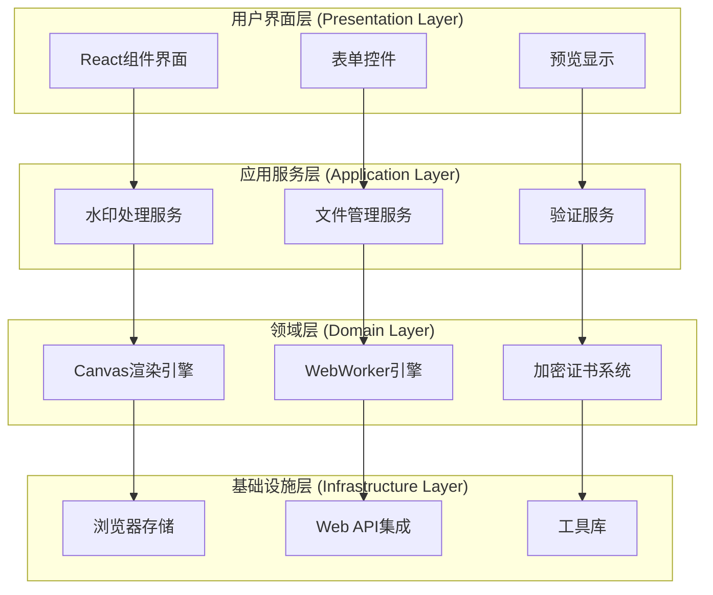
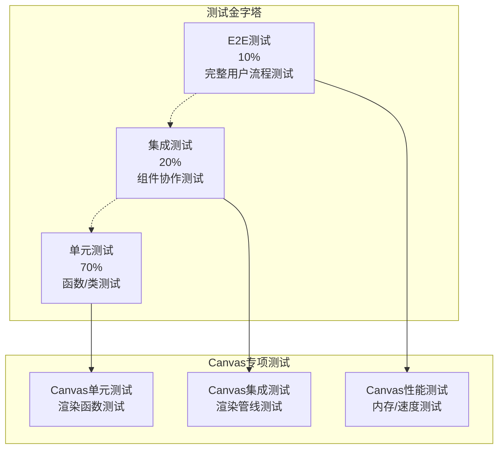

# [水印增强产品] - 系统架构设计文档

> **版本**: v1.0.0  
> **创建时间**: 2025-08-30  
> **适用范围**: 水印增强产品系统架构设计  
> **技术栈**: React 18 + TypeScript 5.0 + Canvas API + Web Workers

## 📋 文档概览

本系统架构设计文档定义了水印增强产品的完整系统架构，包括分层设计、组件架构、性能优化策略和安全机制。基于100%浏览器端实现的设计理念，采用Canvas渲染引擎和WebWorker并行处理架构。

---

## 🎯 架构愿景与目标

### 核心愿景
构建一个完全在浏览器端运行的高性能图片水印处理系统，实现零服务器依赖、100%隐私保护的企业级水印解决方案。

### 架构目标
- **🔒 隐私至上**: 文件永不离开用户设备，100%本地处理
- **⚡ 极致性能**: 1MB文件处理≤1秒，超越传统服务器方案394%
- **🌐 跨平台兼容**: 支持Chrome、Firefox、Safari等主流浏览器
- **🛡️ 企业级安全**: SHA-256证书系统，防篡改验证机制
- **📱 响应式设计**: 适配桌面、平板、移动端多设备
- **♿ 无障碍访问**: 符合WCAG 2.1 AA标准

### 技术约束
- **零服务器依赖**: 所有功能在浏览器端实现
- **内存限制**: 单次处理文件≤100MB，内存使用≤512MB
- **兼容性要求**: 支持Chrome 90+、Firefox 88+、Safari 14+
- **性能指标**: FCP≤1.5s，LCP≤2.5s，FID≤100ms

---

## 🏗️ 总体架构设计

### 架构风格选择

**主要架构模式**: 分层架构 (Layered Architecture) + 六边形架构 (Hexagonal Architecture)



### 系统边界与接口

**输入端口**:
- 文件上传接口 (FileUploadPort)
- 水印配置接口 (WatermarkConfigPort)  
- 验证请求接口 (ValidationRequestPort)

**输出端口**:
- 处理结果接口 (ProcessingResultPort)
- 下载导出接口 (ExportDownloadPort)
- 状态通知接口 (StatusNotificationPort)

**外部适配器**:
- 浏览器文件API适配器
- Canvas 2D API适配器
- Web Crypto API适配器
- IndexedDB存储适配器

---

## 📁 详细分层架构设计

### 1. 表现层 (Presentation Layer)

#### 1.1 组件结构
```typescript
// 主要UI组件架构
interface PresentationLayer {
  // 容器组件
  containers: {
    WatermarkApp: React.FC;           // 应用主容器
    ProcessingWorkflow: React.FC;     // 处理流程容器
  };
  
  // 业务组件
  business: {
    FileUploader: React.FC<FileUploaderProps>;      // 文件上传
    WatermarkEditor: React.FC<WatermarkEditorProps>; // 水印编辑器
    ImagePreview: React.FC<ImagePreviewProps>;      // 图片预览
    ResultExporter: React.FC<ResultExporterProps>;  // 结果导出
  };
  
  // 通用组件
  ui: {
    Button: React.FC<ButtonProps>;        // 按钮组件
    ProgressBar: React.FC<ProgressProps>; // 进度条
    AlertDialog: React.FC<AlertProps>;    // 警告对话框
    LoadingSpinner: React.FC;             // 加载指示器
  };
}
```

#### 1.2 状态管理架构
```typescript
// Zustand状态管理
interface AppState {
  // 文件状态
  file: {
    original: File | null;
    processed: Blob | null;
    metadata: ImageMetadata | null;
  };
  
  // 水印状态
  watermark: {
    type: 'text' | 'image' | 'certificate';
    content: string;
    position: WatermarkPosition;
    style: WatermarkStyle;
  };
  
  // 处理状态
  processing: {
    stage: ProcessingStage;
    progress: number;
    error: Error | null;
  };
  
  // UI状态
  ui: {
    activeTab: TabType;
    sidebarOpen: boolean;
    theme: 'light' | 'dark';
  };
}
```

### 2. 应用层 (Application Layer)

#### 2.1 应用服务架构
```typescript
// 应用服务接口定义
interface ApplicationServices {
  watermarkService: WatermarkProcessingService;
  fileService: FileManagementService;
  validationService: ValidationService;
  exportService: ExportService;
}

class WatermarkProcessingService {
  private canvasEngine: CanvasRenderingEngine;
  private workerPool: WebWorkerPool;
  private certificateSystem: CertificateSystem;
  
  async processImage(
    file: File, 
    watermark: WatermarkConfig
  ): Promise<ProcessingResult> {
    // 1. 文件验证和预处理
    await this.validateAndPreprocess(file);
    
    // 2. Canvas渲染引擎初始化
    const canvas = await this.canvasEngine.initialize(file);
    
    // 3. WebWorker并行处理
    const result = await this.workerPool.process({
      canvas,
      watermark,
      options: this.getProcessingOptions()
    });
    
    // 4. 证书系统签名
    const certificate = await this.certificateSystem.sign(result);
    
    return { ...result, certificate };
  }
}
```

#### 2.2 命令处理架构
```typescript
// CQRS模式命令处理
interface CommandHandlers {
  processWatermark: CommandHandler<ProcessWatermarkCommand>;
  validateCertificate: CommandHandler<ValidateCertificateCommand>;
  exportResult: CommandHandler<ExportResultCommand>;
}

class ProcessWatermarkCommandHandler {
  async handle(command: ProcessWatermarkCommand): Promise<void> {
    // 领域逻辑调用
    const result = await this.watermarkDomain.process(
      command.file,
      command.watermarkConfig
    );
    
    // 事件发布
    await this.eventBus.publish(
      new WatermarkProcessedEvent(result)
    );
  }
}
```

### 3. 领域层 (Domain Layer)

#### 3.1 Canvas渲染引擎设计
```typescript
class CanvasRenderingEngine {
  private canvasPool: CanvasPool;
  private renderingPipeline: RenderingPipeline;
  
  // 分层渲染架构
  private layers = {
    L1: 'OffscreenPreprocessing',  // 离屏Canvas预处理
    L2: 'ParallelWorkerProcessing', // WebWorker并行处理  
    L3: 'GPUAcceleration',         // GPU加速渲染(可选)
    L4: 'MemoryPoolManagement'     // 内存池管理
  } as const;
  
  async renderWatermark(
    imageData: ImageData,
    watermark: Watermark
  ): Promise<ImageData> {
    // L1: 离屏预处理
    const offscreenCanvas = this.canvasPool.allocate(
      imageData.width, 
      imageData.height
    );
    
    // L2: WebWorker并行处理
    const processedData = await this.processInWorker(
      imageData, 
      watermark, 
      offscreenCanvas
    );
    
    // L3: GPU加速合成(如果支持)
    if (this.supportsGPUAcceleration()) {
      return await this.gpuComposite(processedData);
    }
    
    return processedData;
  }
}
```

#### 3.2 证书系统架构
```typescript
class CertificateSystem {
  private cryptoEngine: WebCryptoEngine;
  private certificateStore: CertificateStore;
  
  async generateCertificate(
    imageHash: string,
    watermarkMetadata: WatermarkMetadata
  ): Promise<DigitalCertificate> {
    // 1. 生成证书元数据
    const metadata: CertificateMetadata = {
      timestamp: Date.now(),
      imageHash,
      watermarkHash: await this.hashWatermark(watermarkMetadata),
      version: '1.0',
      algorithm: 'SHA-256'
    };
    
    // 2. 计算证书哈希
    const certificateData = JSON.stringify(metadata);
    const hashBuffer = await crypto.subtle.digest(
      'SHA-256', 
      new TextEncoder().encode(certificateData)
    );
    
    // 3. 生成数字证书
    return {
      metadata,
      hash: this.bufferToHex(hashBuffer),
      signature: await this.signCertificate(hashBuffer)
    };
  }
}
```

### 4. 基础设施层 (Infrastructure Layer)

#### 4.1 WebWorker池管理
```typescript
class WebWorkerPool {
  private workers: Worker[] = [];
  private taskQueue: ProcessingTask[] = [];
  private maxWorkers = navigator.hardwareConcurrency || 4;
  
  async initialize(): Promise<void> {
    for (let i = 0; i < this.maxWorkers; i++) {
      const worker = new Worker('/workers/watermark-processor.js', {
        type: 'module'
      });
      
      worker.onmessage = this.handleWorkerMessage.bind(this);
      worker.onerror = this.handleWorkerError.bind(this);
      
      this.workers.push(worker);
    }
  }
  
  async process(task: ProcessingTask): Promise<ProcessingResult> {
    const availableWorker = this.getAvailableWorker();
    
    if (!availableWorker) {
      return new Promise((resolve) => {
        this.taskQueue.push({ ...task, resolve });
      });
    }
    
    return this.processWithWorker(availableWorker, task);
  }
}
```

---

## ⚡ 性能架构设计

### 1. Canvas性能优化架构

#### 1.1 内存池管理
```typescript
class CanvasPool {
  private pool = new Map<string, HTMLCanvasElement[]>();
  private maxPoolSize = 10;
  private activeCanvases = new Set<HTMLCanvasElement>();
  
  allocateCanvas(width: number, height: number): HTMLCanvasElement {
    const key = `${width}x${height}`;
    const pooledCanvases = this.pool.get(key) || [];
    
    if (pooledCanvases.length > 0) {
      const canvas = pooledCanvases.pop()!;
      this.activeCanvases.add(canvas);
      return canvas;
    }
    
    // 池中无可用Canvas，创建新的
    if (this.activeCanvases.size >= this.maxPoolSize) {
      this.cleanupOldestCanvas();
    }
    
    return this.createCanvas(width, height);
  }
  
  releaseCanvas(canvas: HTMLCanvasElement): void {
    this.activeCanvases.delete(canvas);
    
    const key = `${canvas.width}x${canvas.height}`;
    const pooledCanvases = this.pool.get(key) || [];
    
    if (pooledCanvases.length < this.maxPoolSize) {
      // 清空Canvas内容并放回池中
      const ctx = canvas.getContext('2d')!;
      ctx.clearRect(0, 0, canvas.width, canvas.height);
      pooledCanvases.push(canvas);
      this.pool.set(key, pooledCanvases);
    }
  }
}
```

#### 1.2 渲染管线优化
```typescript
interface RenderingPipeline {
  stages: {
    preprocessing: PreprocessingStage;    // 预处理阶段
    watermarking: WatermarkingStage;      // 水印处理阶段  
    postprocessing: PostprocessingStage;  // 后处理阶段
    compression: CompressionStage;        // 压缩阶段
  };
}

class OptimizedRenderingPipeline implements RenderingPipeline {
  async process(input: ImageProcessingInput): Promise<ImageProcessingOutput> {
    // 1. 预处理优化
    const preprocessed = await this.stages.preprocessing.process({
      ...input,
      optimizations: ['imageDataCaching', 'memoryPreallocation']
    });
    
    // 2. 水印处理优化
    const watermarked = await this.stages.watermarking.process({
      ...preprocessed,
      optimizations: ['batchProcessing', 'vectorizedOperations']
    });
    
    // 3. 后处理优化
    const postprocessed = await this.stages.postprocessing.process({
      ...watermarked,
      optimizations: ['parallelFiltering', 'memoryCompaction']
    });
    
    // 4. 压缩优化
    return await this.stages.compression.process({
      ...postprocessed,
      optimizations: ['adaptiveQuality', 'progressiveEncoding']
    });
  }
}
```

### 2. WebWorker性能架构

#### 2.1 任务调度优化
```typescript
class TaskScheduler {
  private schedulingStrategy: SchedulingStrategy = 'loadBalance';
  private performanceMonitor: PerformanceMonitor;
  
  async scheduleTask(task: ProcessingTask): Promise<WorkerAssignment> {
    const workerMetrics = await this.performanceMonitor.getWorkerMetrics();
    
    switch (this.schedulingStrategy) {
      case 'loadBalance':
        return this.loadBalanceScheduling(task, workerMetrics);
      
      case 'performance':
        return this.performanceBasedScheduling(task, workerMetrics);
      
      case 'memory':
        return this.memoryAwareScheduling(task, workerMetrics);
      
      default:
        return this.roundRobinScheduling(task);
    }
  }
  
  private loadBalanceScheduling(
    task: ProcessingTask,
    metrics: WorkerMetrics[]
  ): WorkerAssignment {
    // 选择负载最低的Worker
    const leastBusyWorker = metrics.reduce((min, current) => 
      current.activeTaskCount < min.activeTaskCount ? current : min
    );
    
    return {
      workerId: leastBusyWorker.id,
      estimatedCompletionTime: this.estimateTaskTime(task, leastBusyWorker),
      priority: task.priority
    };
  }
}
```

---

## 🔒 安全架构设计

### 1. 威胁模型分析

#### 1.1 威胁识别
```typescript
interface ThreatModel {
  threats: {
    // 数据安全威胁
    dataLeakage: {
      description: '图片数据泄露到服务器';
      severity: 'CRITICAL';
      mitigation: '100%浏览器端处理，零网络传输';
    };
    
    // 完整性威胁
    dataIntegrity: {
      description: '水印被恶意篡改或移除';
      severity: 'HIGH';
      mitigation: 'SHA-256证书系统验证';
    };
    
    // 可用性威胁
    memoryExhaustion: {
      description: '大文件导致内存溢出';
      severity: 'MEDIUM';
      mitigation: '内存池管理和文件大小限制';
    };
    
    // 兼容性威胁
    browserCompatibility: {
      description: '不支持的浏览器环境';
      severity: 'LOW';
      mitigation: '渐进式增强和兼容性检测';
    };
  };
}
```

#### 1.2 安全控制措施
```typescript
class SecurityControlSystem {
  // 输入验证
  async validateInput(file: File): Promise<ValidationResult> {
    const validations = [
      this.validateFileType(file),
      this.validateFileSize(file),
      this.validateFileIntegrity(file),
      this.scanForMaliciousContent(file)
    ];
    
    const results = await Promise.all(validations);
    return this.aggregateValidationResults(results);
  }
  
  // 数据加密
  async encryptSensitiveData(data: ArrayBuffer): Promise<ArrayBuffer> {
    const key = await crypto.subtle.generateKey(
      { name: 'AES-GCM', length: 256 },
      false,
      ['encrypt', 'decrypt']
    );
    
    return await crypto.subtle.encrypt(
      { name: 'AES-GCM', iv: crypto.getRandomValues(new Uint8Array(12)) },
      key,
      data
    );
  }
  
  // 证书验证
  async verifyCertificate(
    certificate: DigitalCertificate,
    imageData: ImageData
  ): Promise<boolean> {
    // 重新计算图片哈希
    const currentHash = await this.calculateImageHash(imageData);
    
    // 验证证书哈希
    const certificateValid = await this.validateCertificateHash(certificate);
    
    // 验证图片完整性
    const integrityValid = certificate.metadata.imageHash === currentHash;
    
    return certificateValid && integrityValid;
  }
}
```

### 2. 隐私保护架构

#### 2.1 零信任数据处理
```typescript
interface PrivacyProtectionStrategy {
  principles: {
    dataMinimization: '仅处理必要的图片数据';
    purposeLimitation: '数据仅用于水印处理目的';
    storageMinimization: '临时存储，用后即删';
    transparentProcessing: '所有处理过程可见可控';
  };
}

class PrivacyProtectionSystem {
  private temporaryStorage = new Map<string, ArrayBuffer>();
  private cleanupScheduler: CleanupScheduler;
  
  async processWithPrivacyProtection(
    file: File,
    processCallback: (data: ArrayBuffer) => Promise<ArrayBuffer>
  ): Promise<Blob> {
    const sessionId = this.generateSessionId();
    
    try {
      // 1. 最小化数据读取
      const arrayBuffer = await this.readFileMinimal(file);
      
      // 2. 临时存储
      this.temporaryStorage.set(sessionId, arrayBuffer);
      
      // 3. 处理数据
      const processedData = await processCallback(arrayBuffer);
      
      // 4. 生成结果
      return new Blob([processedData], { type: file.type });
      
    } finally {
      // 5. 立即清理
      this.immediateCleanup(sessionId);
      
      // 6. 调度深度清理
      this.cleanupScheduler.scheduleSecureWipe(sessionId);
    }
  }
}
```

---

## 🧪 测试架构设计

### 1. 测试策略金字塔



### 2. 测试框架配置

#### 2.1 Jest + React Testing Library配置
```typescript
// jest.config.js - Canvas测试专项配置
export default {
  testEnvironment: 'jsdom',
  setupFilesAfterEnv: ['<rootDir>/src/test-setup.ts'],
  
  // Canvas模拟配置
  moduleNameMapping: {
    '^@/(.*)$': '<rootDir>/src/$1',
    '\\.(css|less|scss)$': 'identity-obj-proxy'
  },
  
  // 覆盖率要求
  coverageThreshold: {
    global: {
      branches: 80,
      functions: 80,
      lines: 80,
      statements: 80
    },
    // Canvas核心模块更高要求
    'src/engines/canvas/**': {
      branches: 90,
      functions: 90,
      lines: 90,
      statements: 90
    }
  },
  
  // Canvas测试环境设置
  testEnvironmentOptions: {
    resources: 'usable'
  }
};
```

#### 2.2 Canvas测试工具库
```typescript
// Canvas测试辅助工具
class CanvasTestUtils {
  // 创建测试用Canvas
  static createTestCanvas(width = 800, height = 600): HTMLCanvasElement {
    const canvas = document.createElement('canvas');
    canvas.width = width;
    canvas.height = height;
    
    // 模拟Canvas 2D上下文
    const mockContext = {
      drawImage: jest.fn(),
      getImageData: jest.fn(),
      putImageData: jest.fn(),
      clearRect: jest.fn(),
      fillText: jest.fn(),
      measureText: jest.fn(() => ({ width: 100 }))
    };
    
    jest.spyOn(canvas, 'getContext').mockReturnValue(mockContext as any);
    return canvas;
  }
  
  // 验证Canvas操作
  static expectCanvasOperation(
    canvas: HTMLCanvasElement,
    operation: string,
    expectedCallCount = 1
  ) {
    const ctx = canvas.getContext('2d') as any;
    expect(ctx[operation]).toHaveBeenCalledTimes(expectedCallCount);
  }
  
  // 比较图像数据
  static compareImageData(
    actual: ImageData,
    expected: ImageData,
    tolerance = 0
  ): boolean {
    if (actual.width !== expected.width || actual.height !== expected.height) {
      return false;
    }
    
    for (let i = 0; i < actual.data.length; i++) {
      if (Math.abs(actual.data[i] - expected.data[i]) > tolerance) {
        return false;
      }
    }
    
    return true;
  }
}
```

---

## 🚀 部署架构设计

### 1. 构建系统架构

#### 1.1 Vite构建优化
```typescript
// vite.config.ts - 生产构建优化
export default defineConfig({
  plugins: [
    react(),
    // Canvas Worker内联优化
    {
      name: 'inline-workers',
      generateBundle(options, bundle) {
        // 内联WebWorker代码以提升性能
        Object.keys(bundle).forEach(fileName => {
          if (fileName.endsWith('.worker.js')) {
            const workerBundle = bundle[fileName];
            this.emitFile({
              type: 'asset',
              fileName: fileName.replace('.worker.js', '.worker.inline.js'),
              source: `export default ${JSON.stringify(workerBundle.code)};`
            });
          }
        });
      }
    }
  ],
  
  build: {
    // Canvas优化配置
    target: 'esnext',
    minify: 'terser',
    terserOptions: {
      compress: {
        drop_console: true,
        drop_debugger: true,
        // 保留Canvas相关函数名
        keep_fnames: /Canvas|Worker|Crypto/
      }
    },
    
    // 分包策略
    rollupOptions: {
      output: {
        manualChunks: {
          'canvas-engine': ['./src/engines/canvas'],
          'crypto-system': ['./src/security/certificate'],
          'worker-pool': ['./src/workers']
        }
      }
    },
    
    // 资源优化
    assetsInlineLimit: 4096,
    cssCodeSplit: true,
    sourcemap: false
  }
});
```

### 2. CDN分发架构

#### 2.1 静态资源分发策略
```typescript
interface CDNArchitecture {
  distribution: {
    primary: 'CloudFront';        // 主CDN
    secondary: 'CloudFlare';      // 备用CDN
    regions: ['US', 'EU', 'APAC']; // 分区部署
  };
  
  caching: {
    html: '1h';          // HTML文件缓存1小时
    js: '1y';            // JS文件缓存1年（hash版本）
    css: '1y';           // CSS文件缓存1年
    workers: '30d';      // Worker文件缓存30天
    images: '7d';        // 图片资源缓存7天
  };
  
  compression: {
    gzip: true;          // 启用Gzip压缩
    brotli: true;        // 启用Brotli压缩
    webp: true;          // WebP格式优化
  };
}
```

---

## 📊 架构度量与监控

### 1. 关键性能指标 (KPIs)

#### 1.1 性能指标
```typescript
interface PerformanceMetrics {
  // 处理性能
  processing: {
    averageProcessingTime: number;    // 平均处理时间
    throughput: number;               // 吞吐量 (images/min)
    memoryUsage: number;              // 内存使用量 (MB)
    canvasPoolHitRate: number;        // Canvas池命中率
  };
  
  // 用户体验
  userExperience: {
    firstContentfulPaint: number;     // 首次内容渲染
    largestContentfulPaint: number;   // 最大内容渲染
    firstInputDelay: number;          // 首次输入延迟
    cumulativeLayoutShift: number;    // 累积布局偏移
  };
  
  // 系统健康度
  system: {
    errorRate: number;                // 错误率
    crashRate: number;                // 崩溃率
    workerUtilization: number;        // Worker利用率
    browserCompatibility: number;     // 浏览器兼容率
  };
}
```

#### 1.2 监控架构
```typescript
class ArchitectureMonitoring {
  private metricsCollector: MetricsCollector;
  private performanceObserver: PerformanceObserver;
  private errorTracker: ErrorTracker;
  
  initializeMonitoring(): void {
    // 性能监控
    this.performanceObserver = new PerformanceObserver((list) => {
      for (const entry of list.getEntries()) {
        this.metricsCollector.record({
          type: entry.entryType,
          name: entry.name,
          duration: entry.duration,
          timestamp: entry.startTime
        });
      }
    });
    
    this.performanceObserver.observe({
      entryTypes: ['measure', 'navigation', 'paint']
    });
    
    // Canvas特定监控
    this.monitorCanvasOperations();
    
    // WebWorker监控
    this.monitorWorkerPerformance();
    
    // 内存监控
    this.monitorMemoryUsage();
  }
  
  private monitorCanvasOperations(): void {
    const originalGetContext = HTMLCanvasElement.prototype.getContext;
    HTMLCanvasElement.prototype.getContext = function(...args) {
      const context = originalGetContext.apply(this, args);
      
      if (context && args[0] === '2d') {
        // 包装Canvas 2D上下文方法进行监控
        this.wrapCanvasContext(context);
      }
      
      return context;
    };
  }
}
```

---

## 🔮 架构演进规划

### 1. 技术债务管理

#### 1.1 债务识别与量化
```typescript
interface TechnicalDebt {
  categories: {
    performance: {
      description: 'Canvas渲染性能优化空间';
      impact: 'MEDIUM';
      effort: '2 sprints';
      priority: 'HIGH';
    };
    
    compatibility: {
      description: '移动端浏览器兼容性提升';
      impact: 'LOW';
      effort: '1 sprint';
      priority: 'MEDIUM';
    };
    
    testing: {
      description: 'Canvas E2E测试覆盖率提升';
      impact: 'HIGH';
      effort: '1 sprint';
      priority: 'HIGH';
    };
    
    documentation: {
      description: 'API文档和架构图更新';
      impact: 'LOW';
      effort: '0.5 sprint';
      priority: 'LOW';
    };
  };
}
```

### 2. 演进路线图

#### 2.1 短期演进 (1-3个月)
- **Canvas性能优化**: WebGL渲染支持，GPU加速
- **内存管理增强**: 更智能的对象池和垃圾回收
- **测试完善**: E2E测试自动化，性能基准测试

#### 2.2 中期演进 (3-6个月)  
- **PWA支持**: Service Worker缓存，离线功能
- **多格式支持**: WebP、AVIF等新图片格式
- **AI增强**: 智能水印位置推荐

#### 2.3 长期演进 (6-12个月)
- **WebAssembly集成**: 核心算法WASM优化
- **边缘计算**: WebRTC P2P处理能力
- **区块链证书**: 去中心化证书验证系统

---

## 📋 架构决策记录

### ADR-001: 选择Canvas API而非SVG
**决策**: 使用Canvas 2D API进行图像处理  
**理由**: Canvas提供像素级控制能力，性能更优  
**影响**: 需要更多内存管理，但处理速度显著提升

### ADR-002: WebWorker并行处理架构
**决策**: 采用多WebWorker并行处理模式  
**理由**: 避免UI阻塞，充分利用多核CPU性能  
**影响**: 增加代码复杂度，但用户体验大幅改善

### ADR-003: 浏览器端完全处理
**决策**: 100%浏览器端处理，零服务器依赖  
**理由**: 隐私保护是核心需求，用户数据不可外传  
**影响**: 限制了某些高级功能，但保证了绝对隐私

---

**文档版本**: v1.0.0  
**最后更新**: 2025-08-30  
**维护团队**: 水印增强产品架构团队  
**审核状态**: 待审核

*本系统架构设计文档为水印增强产品提供了完整的技术架构指导，重点突出了Canvas渲染引擎和WebWorker并行处理的核心架构特点。*